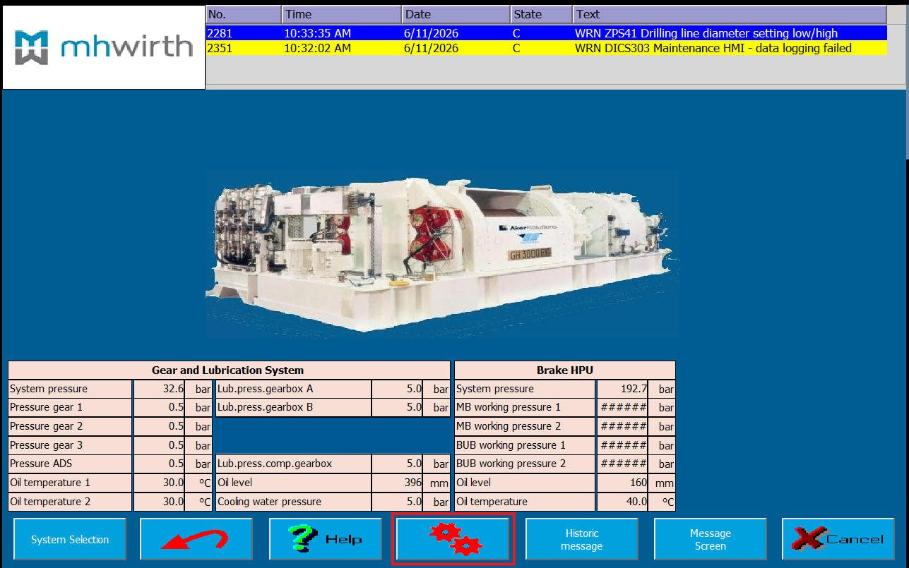
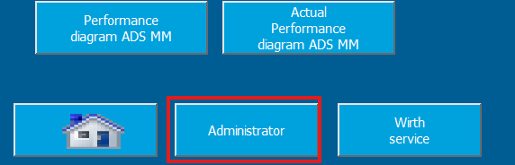
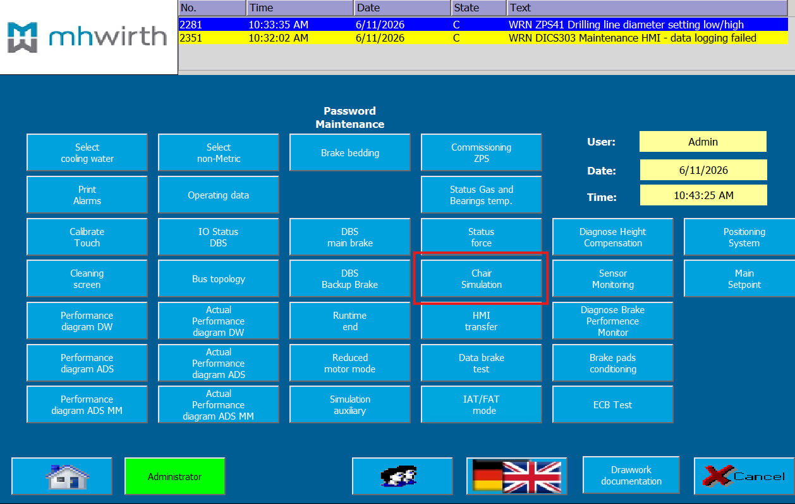
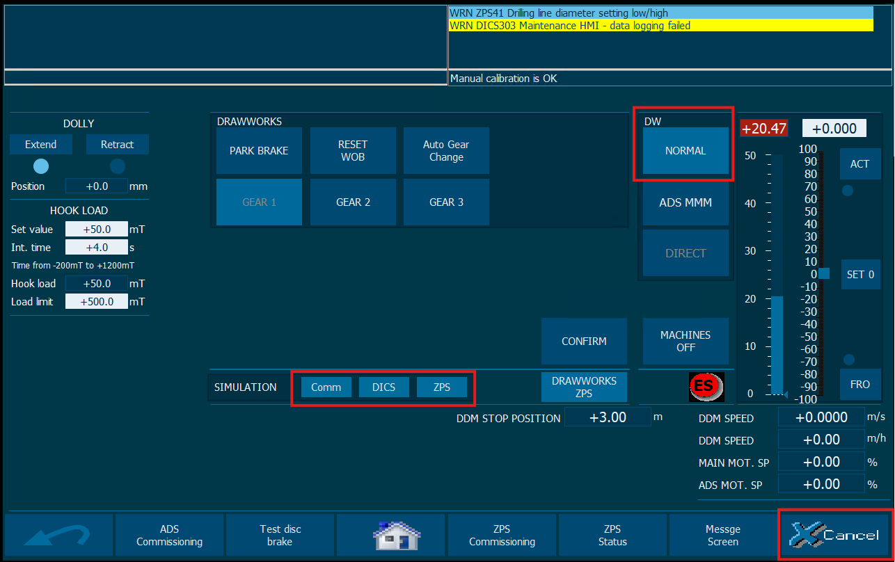

# Drawworks Simulation

## Step 7 Classic PLC
1. Open 2 PLC simulators for
	1. DICS
	2. ZPS
2. Upload code: [refer to manual](../../../S7/Step7_Simulation/Step7_Simulation.md)

## TIA Panel
1. Go to Settings 
2. Log in 
	1. The Username is `Admin`
	2. The password can be found in the `Software release note.docx` or in PAM
3. Go to `Chair Simulation` 
4. 
5. Turn on all 3 simulations
6. Put DW into Normal mode
7. Press `Cancel` in case something might not work and try again

