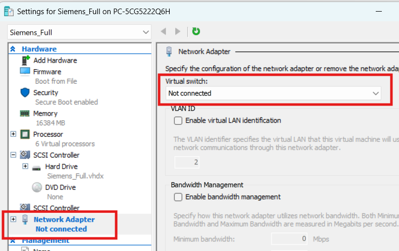
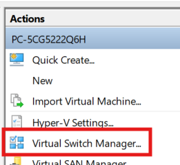
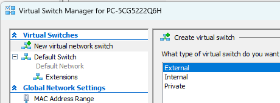
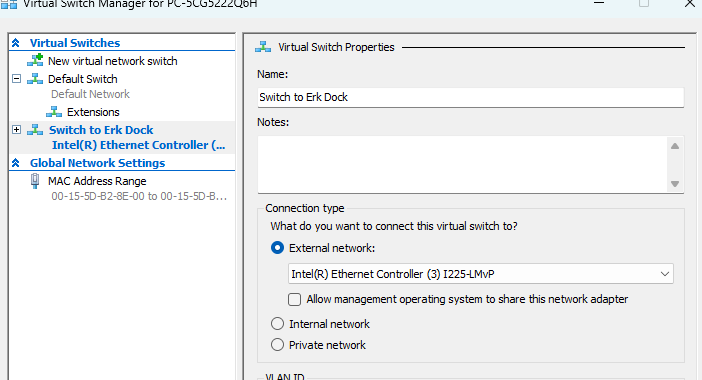

## Disable Hyper-V Network communication
- Turn off VM
- Open Machine Settings
- Disconnect Network
- 
- Open Switch Manager
- 

## Enable Hyper-V Network communication
- Create virtual switch
- turn off VM
- Open Settings
- select newly created switch
- start VM

## Add Virtual switch
- 
- 

## Remove Virtual switch
In order to use an ethernet adapter on your local PC again, you need to remove the adapter from the switch in Hyper-V
- Open the Switch Manager
- Remove the switch using the Network-Device you need locally

## VM Netzwerkeinstellungen
- vor der Arbeit setzen
- nach der Arbeit zurücksetzen

