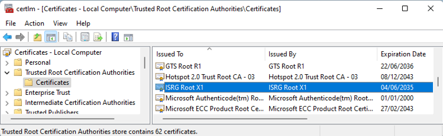

1.	Only required if IXON VPN does not function for any reason. During initial testing of the VM it just worked fine. But just before the release of the VM, it did not work anymore. Do the following in the VM:
	1.	On your Windows system, open Manage computer certificates.
	2.	Go to Certificates - Local Computer > Trusted Root Certification Authorities > Certificates.
	3.	Search for ISRG Root X1.
	4. 

Is ISRG Root X1 not in the list? Please follow the steps below to install it.
1.	Copy the file  to the VM
2.	Right-click the file isrgrootx1.der and select Install Certificate.
3.	Select Local Machine as the Store location.
4.	Select the Trusted Root Certification Authorities as the Certification store.
5.	Close and re-open your browser.
