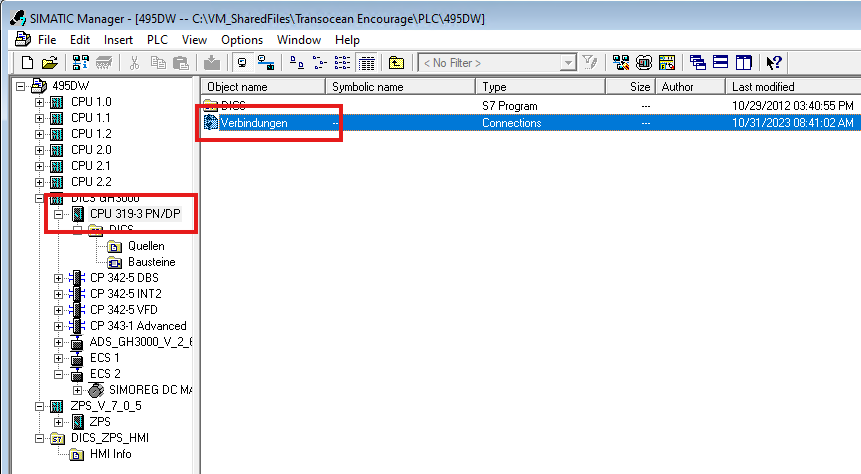
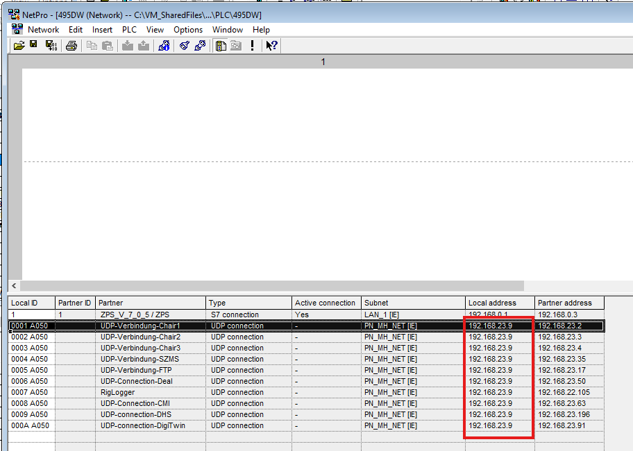

## "Not assigned" issue in Devices & Networks
- make sure the correct GSD file is installed
- reopen the projects
- if that does not work, clone the project again

## PN/PN Setup
- When setting up a PN/PN Coupler, the coupler will recieve all settings from the PLC if it is factory reset
- If not factory reset, setting the name of the ports should be enough for the Coupler to get the settings from the PLC
- Each port (X1/X2) will get their settings from the PLC they are connected to

## Find Network Info
- Click on the CPU in the Step7 Project
- Open "Connections"
- 
- Find "Local address"
- 