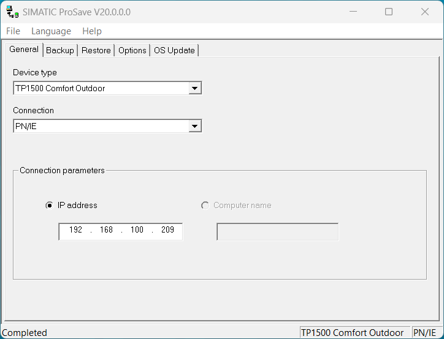
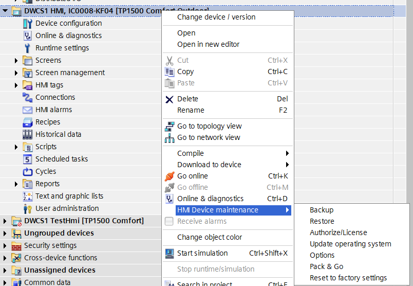
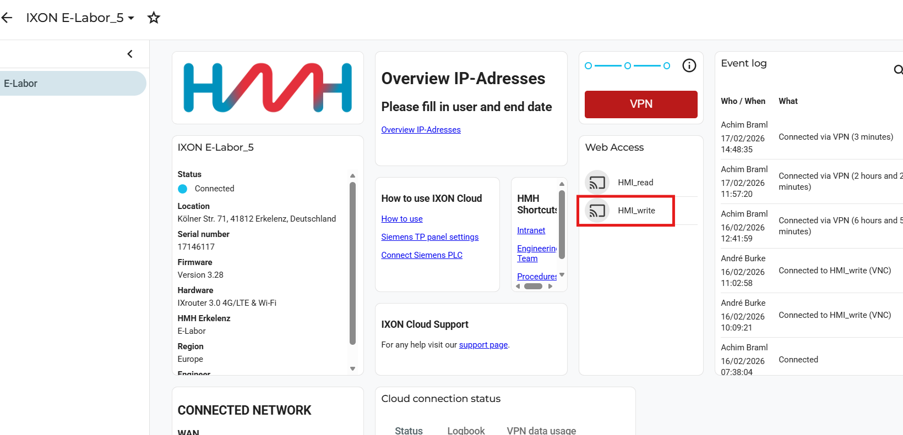

## Software Load on Safety CPU
#F-CPU
- Should the load of a program fail, try the following:
1. Delete memory card in Notebook. Only delete files, never format!!!
2. PLC -> delete memory via menu
3. PLC -> factory defaults via menu

## HMI Image Update
#Firmware
HMI Images können, sofern sie aus welchem Grund auch immer nicht per TIA übertragen werden können auch per ProSave übertragen werden

Simatic ProSave kann entweder direkt als Anwendung aus dem Startmenü, oder aber aus TIA heraus gestartet werden.
Der Start direkt über das Startmenü ist mit Einschränkungen verbunden. Es funktioniert die Verbindung mit den Comfort Panels nicht!!!
  
Der Start über TIA erfolgt über einen Rechtsklick auf das Panel im Projekt und anschließend die Auswahl eines der Punkte im Menü "HMI Device maintenance"  
  
Nach Auswahl des Gerätes über das TIA-Geräte-Suchfenster, öffnet sich ein ProSave Fenster ohne Reiter zu dem Menüpunkt den man vorher gewählt hat.  

## Show HMI Panel via Ixon

## HMI Panel Smart Client (remote access) aktivieren
- Sm@artClient Software
DWCS_Testing_Com_Support.docx in sharepont suchen
Alternativ zur Ixon connection könnte man auch VNC Viewer verwenden

## Passwort für Steuerungen
(password passwörter)
Liegen in Octoplant. Beim auschecken einer Software mit [x.y] Versionsnummer, liegt im Verzeichnis eine .docx. Diese beinhaltet die Passwörter

## S7 Online
- Man kann in TIA nur online gehen, wenn die Software mit der gleichen TIA Version in die SPS geladen wurde-

