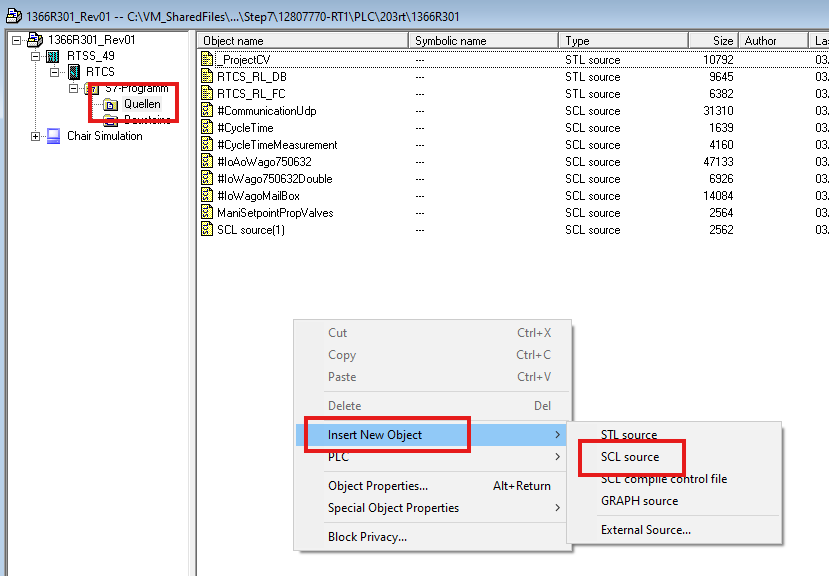
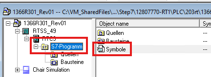
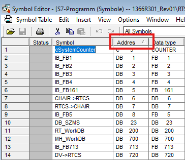
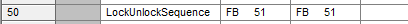
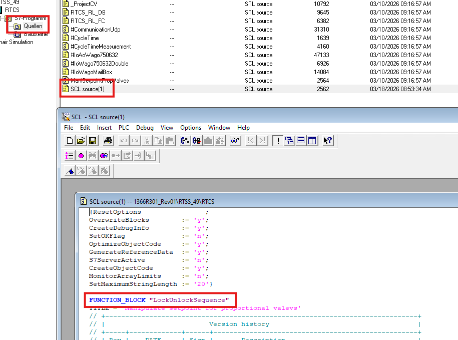
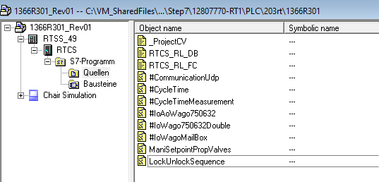

1. Neue SCL Quelle hinzufügen
	- 
	- Erzeugt eine leere Datei
	- template code einfügen:
```pascal
{ResetOptions                ;
OverwriteBlocks        := 'y'; 
CreateDebugInfo        := 'y';
SetOKFlag              := 'n';
OptimizeObjectCode     := 'y';
GenerateReferenceData  := 'y';
S7ServerActive         := 'n';
CreateObjectCode       := 'y';
MonitorArrayLimits     := 'n';
SetMaximumStringLength := '20'}   
 
FUNCTION_BLOCK "MyFbName"
TITLE = ''
(*
Revision no.  : x.y
Master path   : 
********************************************************************************
Author        : Burke
Description   : 
Input parameter: 
Output parameter: 
Calls       :     
Remarks     :  
Revision Description:
Revision no. / Revision made by / Revision date:
--------------------------------------------------------------------------------
V1.0 / Burke / 24.03.2026
1. Created for project
*)
 

VERSION: '1.0'
//KNOW_HOW_PROTECT

VAR_INPUT

END_VAR
VAR_OUTPUT

END_VAR
VAR_IN_OUT
    
END_VAR
VAR
    bTest : BOOL;
END_VAR
VAR_TEMP

END_VAR
CONST

END_CONST
    bTest := TRUE;            
END_FUNCTION_BLOCK
```
2. neues Symbol für den neuen FB einfügen
	- Symbol Editor öffnen  
	
	- Symbol Editor nach Adresse sortieren  
	
	- Rechtsklick auf ein Symbol -> insert Symbol
	- Neues Symbol benennen  
	
3. SCL Quelle umbenennen
	- Neue SCL Quell-Datei öffnen  
	
	- Namen hinter 'FUNCTION_BLOCK' in Anführungszeichen eintragen
	- Speichern
	- Kompilieren
	- Schließen  
	- Der Ordnung halber noch den Dateinamen der Source anpassen  
	
4. Taucht der neue FB jetzt schon in der Liste der FBs auf?


dann neuen FB in fb einfügen  
rechtsklick in multi umwandeln  
dahin gehen, wo der alte FB aufgerufen wird.   
	da wird Step7 merken, dass der DB ein update braucht. YES  