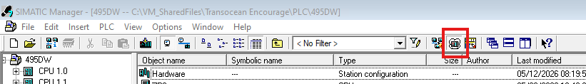
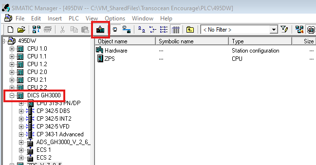
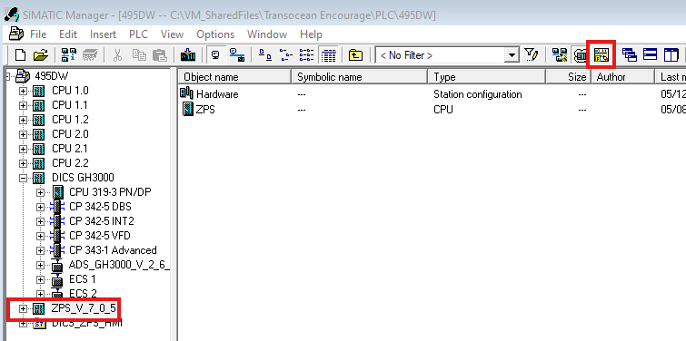
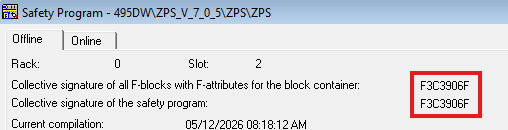

# Simulate Step7 PLC Software

## Open Simulator
1. Open the PLC Project in question
2. Open the PLC Simulator: 

## Download Standard CPU Project
1. Select the CPU that you want to simulate and press the `Download` button 
2. Accept all the dialogs

## Download Safety Project
1. A safety PLC most likely still has non-safety code. Do a normal `Download` first!
2. Select the CPU that you want to simulate and press the `Edit safety program` button 
3. Make sure the signatures are equal 
	1. Should the signatures not match, press `Compile`
4. Press `Download`
5. Accept all the dialogs

