# Cimplicity
(drillview dv hmi)

## Cimplicity Software Versions
|Version reported in .gef file|Software Version / ServicePack|Used Installers|
| ---|---|---|
|8 20 20419|||
|8 20 20453|8.20 & SP HMI-8.2.000001 & SP6 & SP12|CIM_8.2 & SP6 & SP12|
|8 20 20313|||
|8 20 20326|8.20 & SP HMI-8.2.000001|CIM_8.2|
|8 20 20419|8.20 & SP HMI-8.2.000001 & HMI-8.2.000006|CIM_8.2 & SP6|

jetzt installiert
8.2
SP 6
SP12

## Install
1. Run `InstallFrontEnd.exe`
2. Select `Install CIMPLICITY x.x Server`
3. If asked for SQL Password, enter `Cimpli.1`

## Simulator zur Anlage finden und verbinden
- IPAM öffnen
- 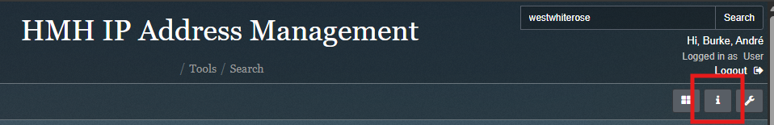
	- aufs "i" klicken
- 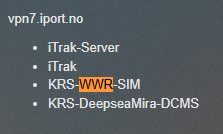
	- per STRG-F nach dem Rig der Wahl suchen
- 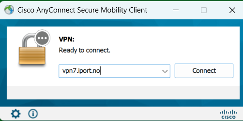
	- die VPN Domain aus IPAM in AnyConnect einfügen
- Cisco Anyconnect verbinden
- 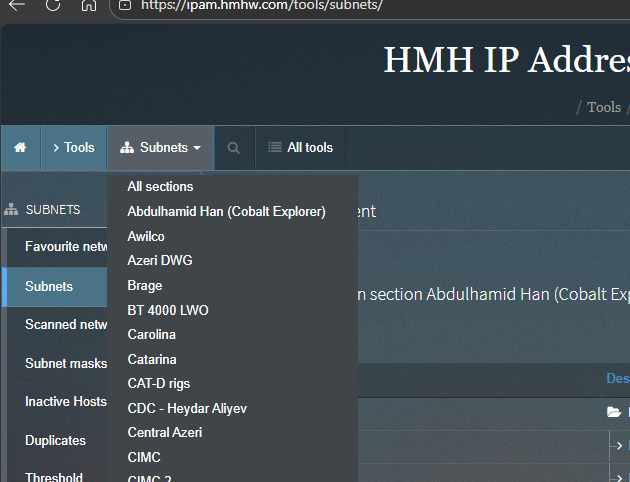
	- in IPAM das Subnets Dropdown öffnen und per STRG+F nach dem Rig suchen
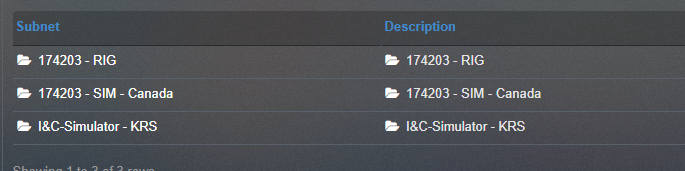
- Dann VNC viewer öffnen und zur IP aus IPAM
RIG wählen

üblicherweise sind die Cimplicity PC im Netz Drillview, für ältere Projekte allerdings in PLC

## Login
Drillview Passwort:
user: DEVELOPER
pw : roalda

## Korrektur fehlerhafter Red-Dots
- 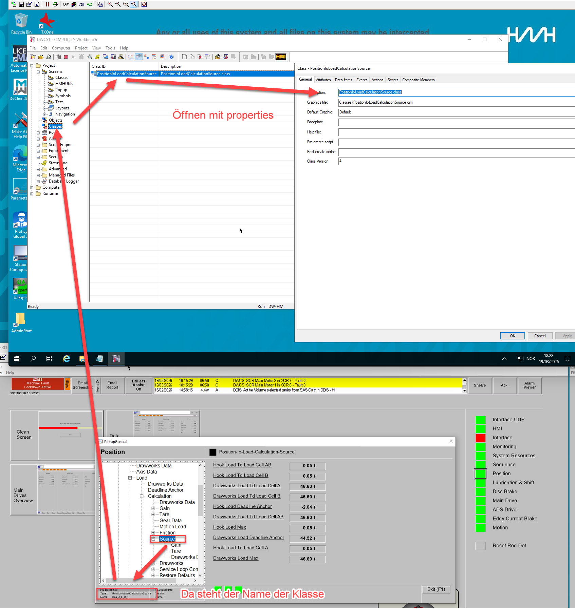  
- 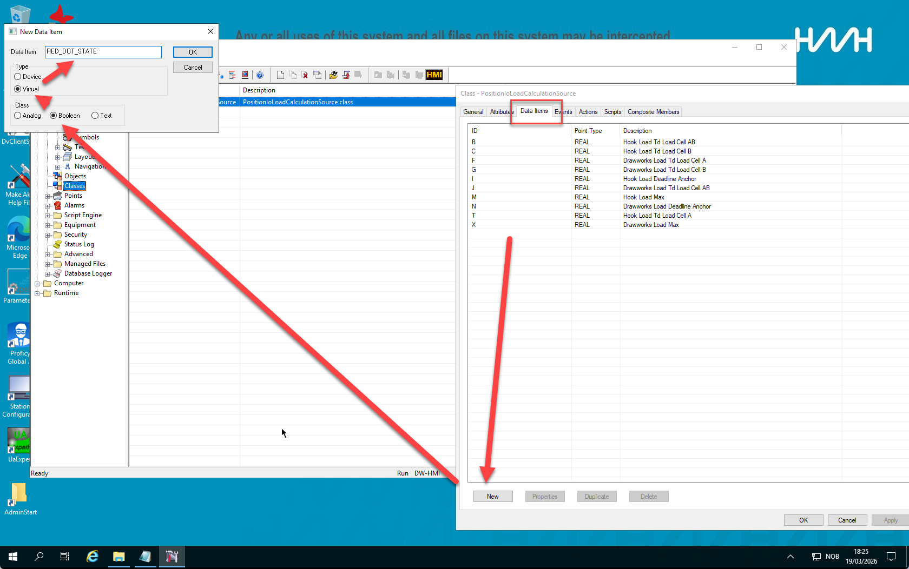  
- 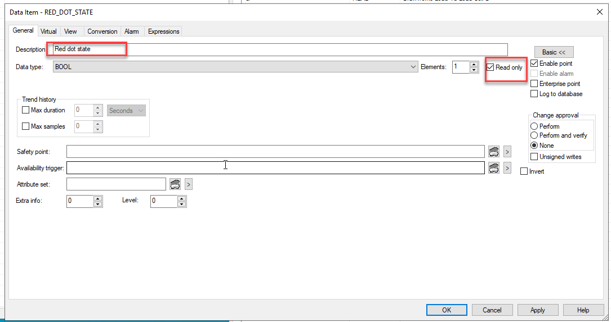  
- 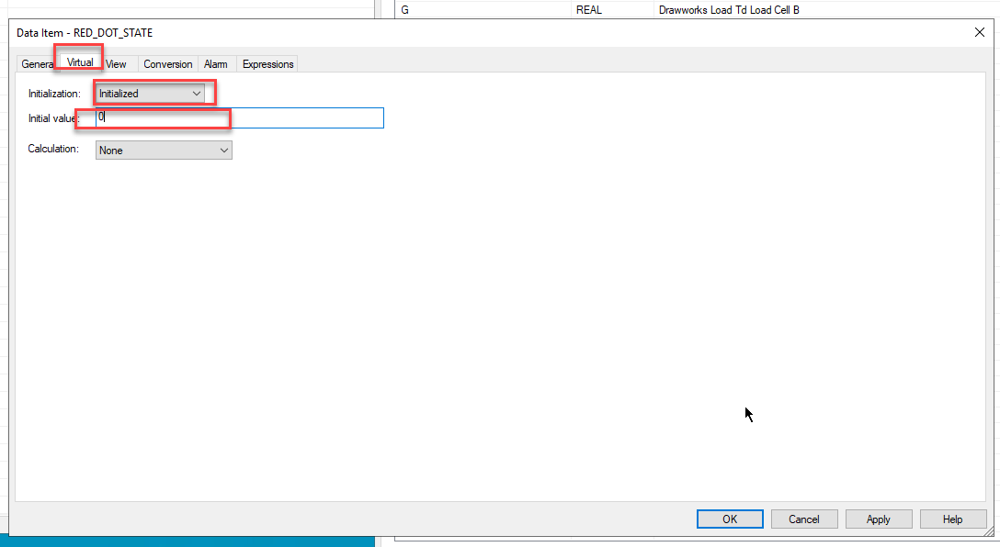  

## Software finden
Drillview fürs DW ist in Octoplant um DLS Ordner unter dem jeweiligen Projekt und dann im jeweiligen Node zu finden. z.B. DWCS

## Korrigieren der Popup Screens
# vielleicht den einfachen weg gehen und nur 2 x-positionen von für labels / fields annehmen

### Positionen der Labels / Fields
	pos als label bottom/left, field top/left
	1.	610/288, 610/438	13.	610/615, 610/765
	2.	584/288, 584/438	14.	584/615, 584/765
	3.	558/288, 558/438	15.	558/615, 558/765
	4.	532/288, 532/438	16.	532/615, 532/765
	5.	506/288, 506/438	17.	506/615, 506/765
	6.	480/288, 480/438	18.	480/615, 480/765
	7.	454/288, 454/438	19.	454/615, 454/765
	8.	428/288, 428/438	20.	428/615, 428/765
	9.	402/288, 402/438	21.	402/615, 402/765
	10.	376/288, 376/438	22.	376/615, 376/765
	11.	350/288, 350/438	23.	350/615, 350/765
	12.	324/288, 324/438	24.	324/615, 324/765

- In der ersten Spalte dürfen die Fields maximal auf left 506 stehen um die 18pt padding zur Linie einzuhalten

### Automatisierung
#### Erkenntnisse
- als .ctx lassen sich die Dateien gut verarbeiten
- kann ich sie direkt als .cim verarbeiten um die manuelle Konvertierung zu umgehen?
	- suche nach "Ddis Cabinet"
		- hex 4400640069007300200043006100620069006E0065007400
		- unmittelbar davor steht:
			0041007200690061006c0000000000f0000000010000000000000001000000000000ff01000000000000ff0100000001000000000000ff000000000b000000000000000100000000000080010000003b010000640000001200000080160000982b00000c
		- unmittelbar dahinter steht:
			008e0144000000000000000053010000005d5d0a4100720072006100790049006e0064006500780000020000005d
		- position is 
			left 
				288pt (0x120) (288 als hex: 320038003800)
				5760 (0x1680) (im binFile zu finden als 0x8016)
			top
				558pt (0x22E)
				11160 (0x2B98) (im binFile zu finden als 0x982B)
			width
				70,7pt
				1414 (0x586)
			height
				14,05pt
				281 (0x119)
			calculated manually
				right
					288pt + 70,7pt = 358,7pt
					7174 (0x1C06)
				bottom
					558pt + 14,05pt = 572,05pt
					11441 (0x2CB1)
		- block for text
			- start with 2A 00 00 00 00 00 00 00 00 A0FFFFFFFF07000000
			- ends with 8E
			- unverändert
				- 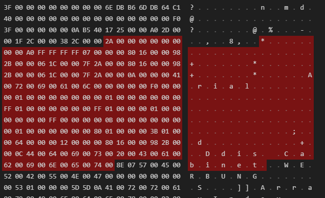
				- 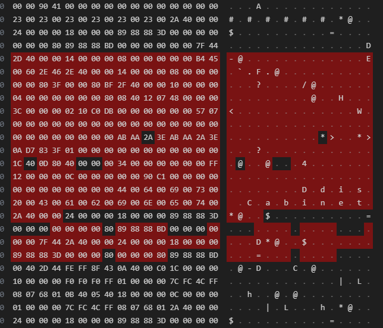
				- 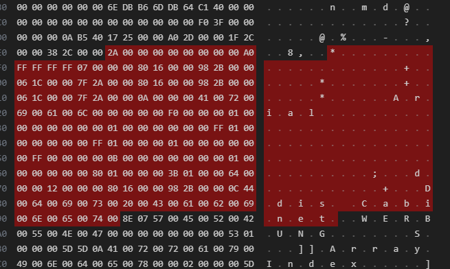
			- verschoben1
				- 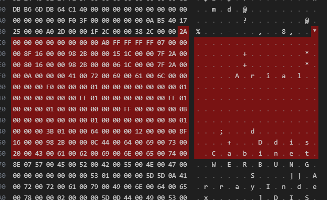
				- 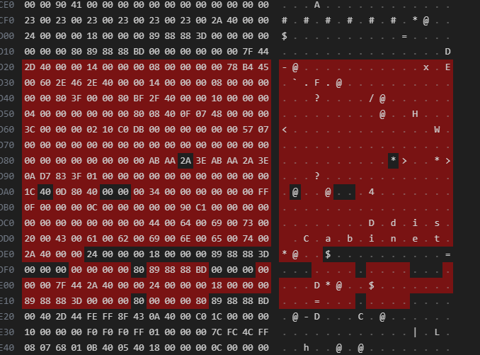
				- 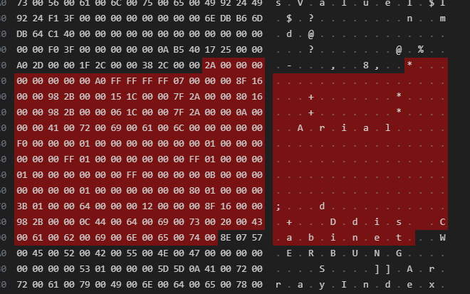
			- man könnte die relevanten blöcke aus den verschiedenen Dateien (unverändert, verschoben1, verschoben2) in einzelne Dateien kopieren um nur die Relevanten informationen einfacher vergleichen zu können.
		- block for text-field
			- start with (8Exx[TextAlsHex])?
			- end with 
			- durch löschen identifizieren
	- suche nach "Emergency Stop Button1"
		- hex 45006d0065007200670065006e00630079002000530074006f007000200042007500740074006f006e003100
		- unmittelbar davor:
			0041007200690061006c0000000000f0000000010000000000000001000000000000ff01000000000000ff0100000001000000000000ff000000000b000000000000000100000000000080010000003b0100006400000012000000801600009029000016
		- dahinter 008e0145000000000000000053010000005d5d0a4100720072006100790049006e0064006500780000020000005d
	- suche nach Ddis Cabinet
		- hex 4400640069007300200043006100620069006E0065007400
		1. Vorkommen
			- 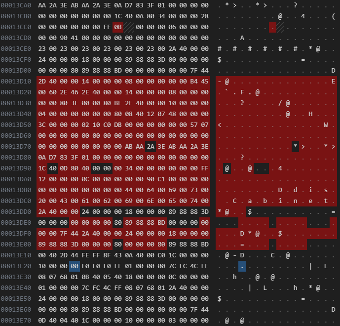
		2. vorkommen
			- 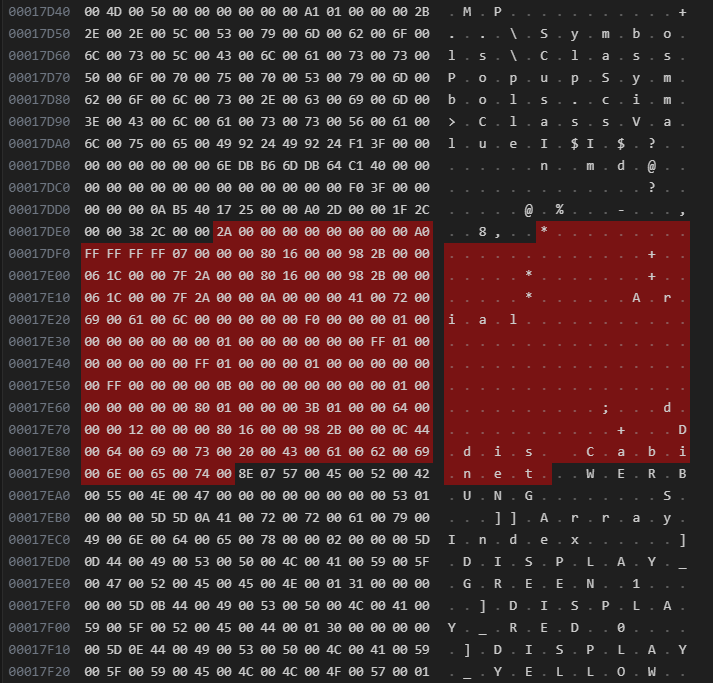
	- besondere Bedeutung scheint auch dieser Part zu haben:
		24000000180000008988883D000000
	- allgemein
		- text block
			- starts with 2A0000000000000000A0FFFFFFFF07000000
			- ends with 8E
			- exists twice per file


- Keyswitch: 4B0065007900730077006900740063006800
- Valve[1]: 560061006C00760065005B0031005D
- Caliper_RW[1]: 430061006C0069007000650072005F00520057005B0031005D
- Number Of Installed Brake Systems: 4E0075006D0062006500720020004F006600200049006E007300740061006C006C006500640020004200720061006B0065002000530079007300740065006D0073

- html testcode  
```javascript
const tmpls = cimLogic.html.getTemplates()  
console.log(tmpls) // verify templates  
const resultWrapper = $('#resultWrapper');  
const result = $(tmpls.resultTemplate).appendTo(resultWrapper);  
console.log(result);  
const resultContent = result.children('.content');  
```


