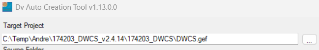
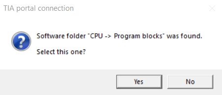
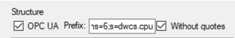
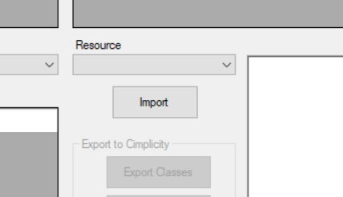
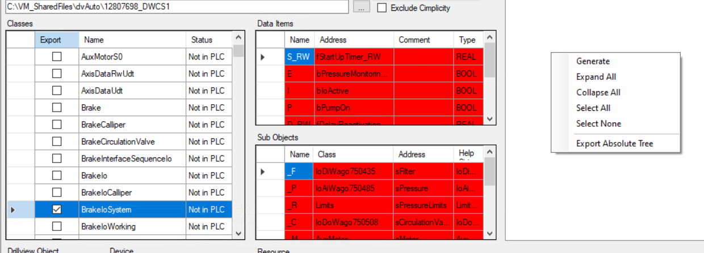

## DV Auto Create
1. Select cimplicity project:

2. "Exceptions.txt" in den source-folder legen
3. click "Generate XML"
4. Open TIA
5. Open Project in TIA
6. Make sure you are not online!
7. Select TIA Project in DVAutoCreation
8. In TIA allow DVAuto access
9. Yes  
  
10. 
11. Import  
  
12. Rechtsklick -> Generate  
  

## Absprache mit Achim
- 17.03.2026
### Ablauf
#### Prerequisites
1. in CIMP alle AlarmObjekte löschen
2. im CIMP-Projekt-Ordner im Ordner "alarm_help" alle Dateien löschen
3. In CIMP "Objects" öffnen und nach "MON*" filtern. Dann alle gefundenen Objekte löschen. Diese werden neu erstellt
4. TIA muss mit dem entsprechenden Projekt geöffnet sein, damit DVAuto darauf zugreifen kann
5. CIMP schließen
#### DV Auto Usage
- "Target Project": Hier das DrillView (Cimplicity) Projekt auswählen
- "Source Project": Hier das TIA Projekt auswählen
- OPC UA
	- Pfad muss auf den Server auf dem PC verweisen. Standardeinstellung ist hier eine PLC. Der korrekte Pfad steht in der Alarmliste im "Sheet Control" bei "OPC-Prefix"
	- Haken bei "Without Quotes" aktivieren
- Button 'Generate XML' drücken. Es werden aus dem TIA Projekt alle sources ins XML Format konvertiert, damit DVAuto später hierauf zugreifen und alle Objekte und Variablen auslesen kann
- Button 'Import' drücken
- Manchmal landet unter 'DataItem' eine Struktur statt eines primitive. Dies betrifft nur manche Klassen
- DataItems:
	- orange markierte sind neu
	- rot markierte wurden in TIA gelöscht und entfallen künftig
- Klassen:
	- Get_IM_Data & Firmware müssen immer abgewählt sein
	- 'IoAoWago' und ähnliche immer weglassen
	- 'DWCS1_RL' (RL für Riglogger) weglassen. Gilt auch für 'RTCS1_RL' etc
- Button 'Export Classes'führt zu Update in CIMP
- Wenn Fehler in Klassen auftreten, prüfen ob für alle Dataitems
	- ein Name vorhanden ist -> Namen vergeben
	- ein komplexer Datentyp vorhanden ist -> rechtsklick - 'Toggle Selection'
	- nach Korrektur erneut Button 'Export Classes'
- In Structure rechtsklick - Generate
	- automatisch durchgestrichene wurden per 'Exceptions' file ignoriert
- Jetzt können noch die Namen / Ressources von Objekten im Tree angepasst werden
- Button 'Export Object Tree' drücken. Dieser Prozess kann sehr lange dauern
- 
#### Wichtige Dateien
- Im Source-Folder gibt es eine Excel Datei "Parameter Unit Mapping"
	- wo kommt die her?
- Alarm-Liste liegt in Octoplant im Ordner 'PLC Parameters'