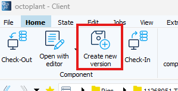
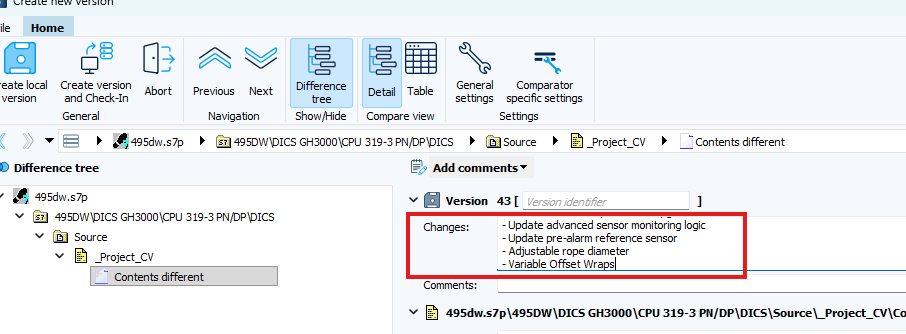
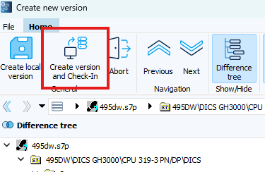

# Octoplant

## Check-In Version after Review
1. In PLC-Software: Update Review name and date in Project CV
2. In Octoplant copy & check `Changes-Text` from last commit. Should have CCN number & title
3. Click on `Create new Version`  

4. paste Changes-Text  

5. Add the Version from the PLC Project-CV in the `[]` in Octoplant
6. Click `Create version and Check-In`  

