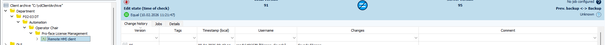
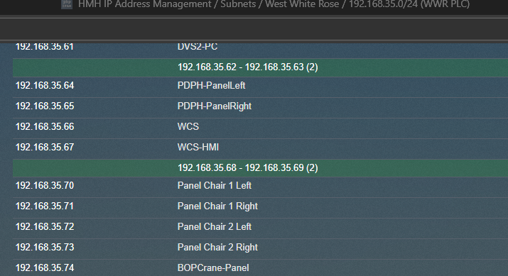
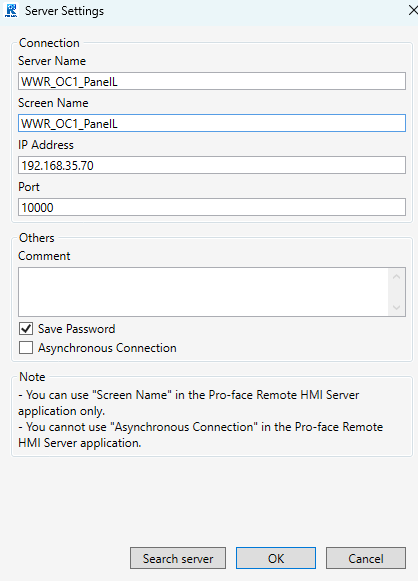
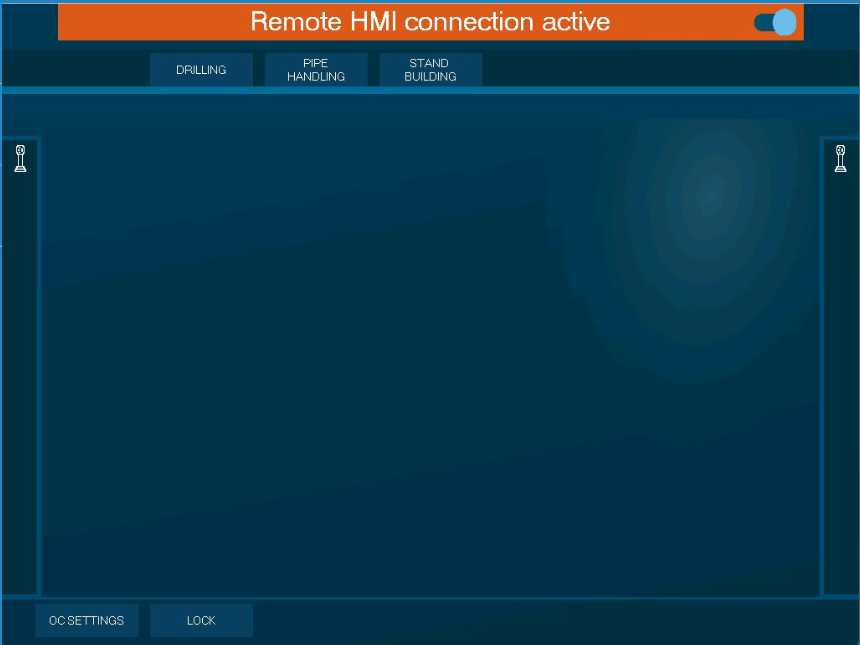
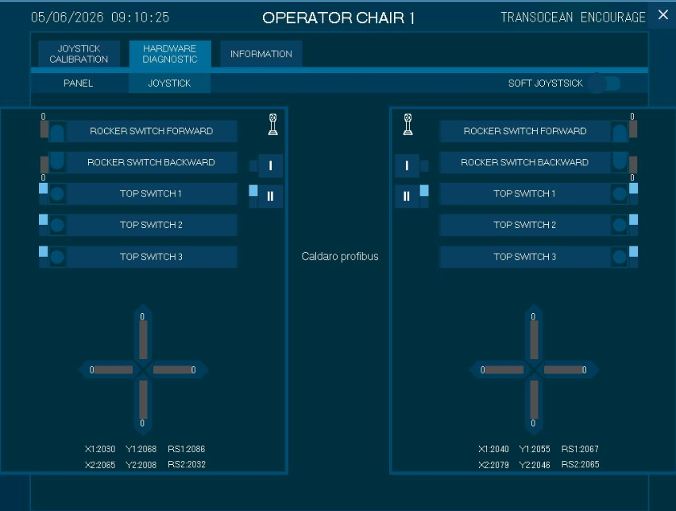
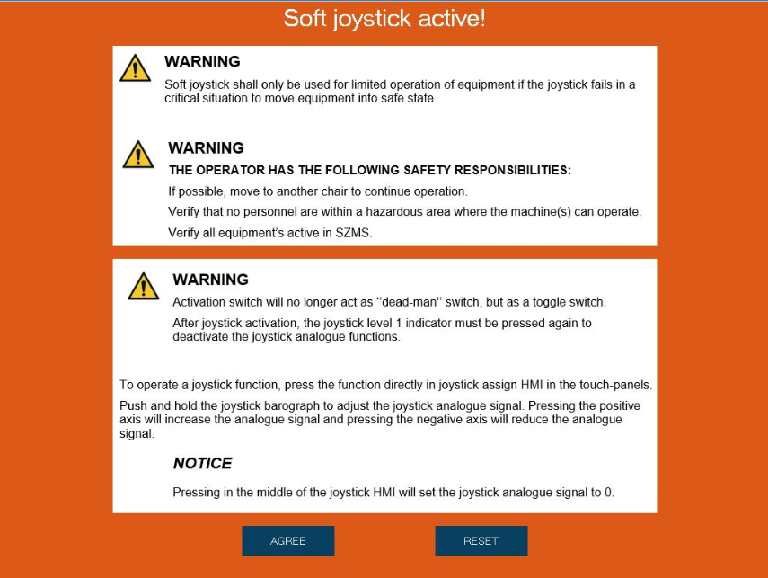

# Get Proface license
1. Checkout this path in Octoplant  

... should be self-explanatory

- pro-face passwort: `Proface.1`  
  
  

## Soft-Joystick muss aktiviert werden
### Neuere Maschinen / Maschinen mit Software-Update 
- Freigabe für Soft-Joystick wird per SPS übergeben
### Ältere Maschinen
- Freigabe für Soft-Joystick wird über Proface gemacht.
1. Alle Anlagen im OC abschalten
2. Auch die Tabs oben deaktivieren
3. 
4. Unten Links auf `OC Settings`
5. Unter `HARDWARE DIAGNOSTIC` -> `JOYSTICK` oben rechts `SOFT JOYSTICK` aktivieren
	1. 
	2. Confirm Warning 
6. 

