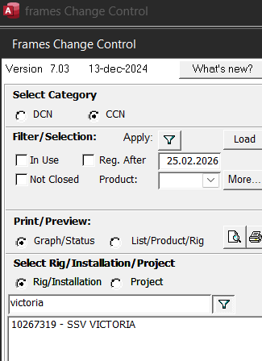
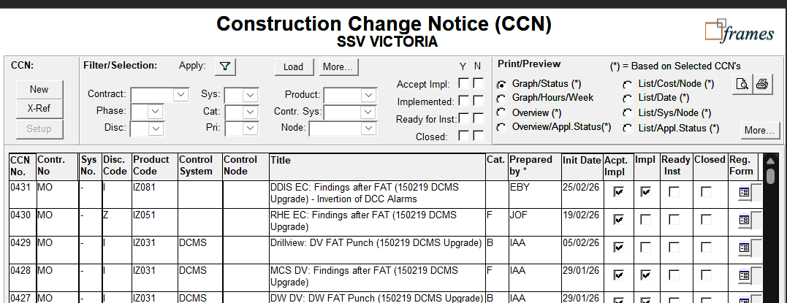
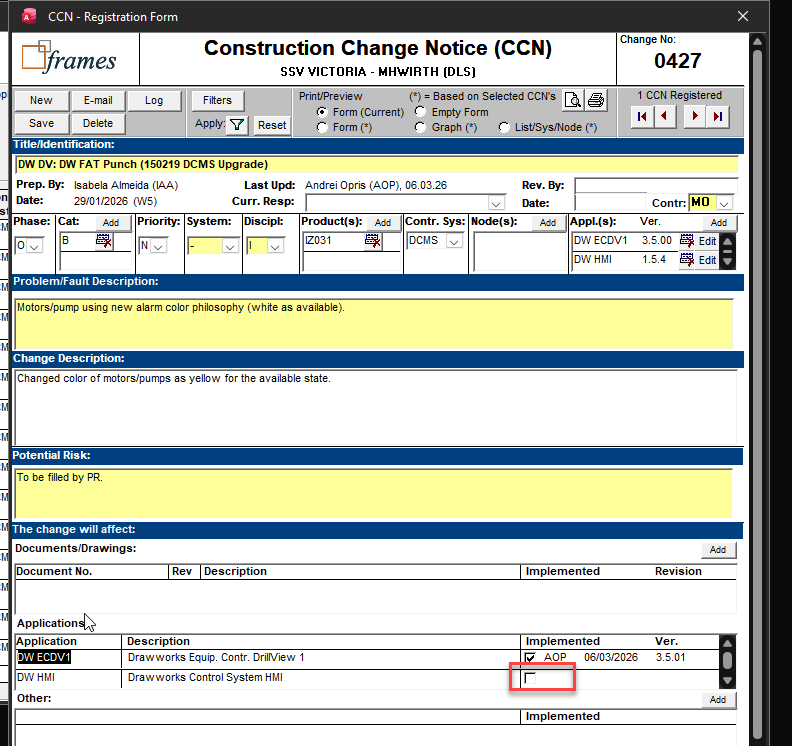

# Frames CCN
## Find a change request
1. Search for the Rig in question
	- 
	- click the rig
2. Find the CCN in question
	- 
	- click the button in the "Reg. Form" column to open the CCN
3. See what needs to be done
4. ...

## Upload checklist to CCN

## Mark software as uploaded in CCN
