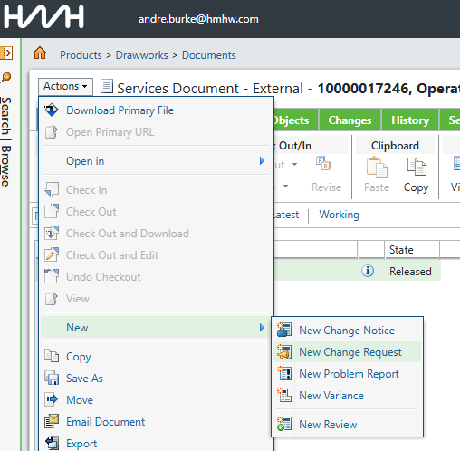

## Software changes
### CCN from Frames
1. See what changes need to be done [Frames CCN](<Frames CCN/Frames-CCN.md>)
### Get Software from octoplant
- Passwords can be found in the checked out folder under /DLS/ if needed
1. Change software according to needs
### Test List
1. Write a list of tests that have to run, in order to verify your code is running fine
2. Use these tests to make sure your code is ok
3. Transfer these tests into framesCcn
### In Code comments
1. Use Octoplant to see all the changes, that you implemented
2. Document all changes in the source code
3. Push with Octoplant

### Windchill Docu Update
1. Update document in [Windchill](<../Windchill/Windchill.md>)
- find the document that needs changing

- change document
