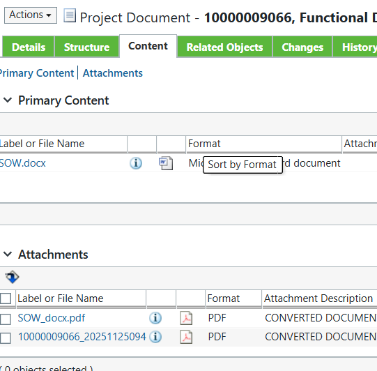
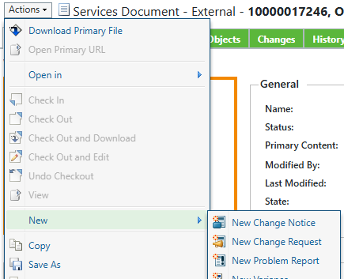
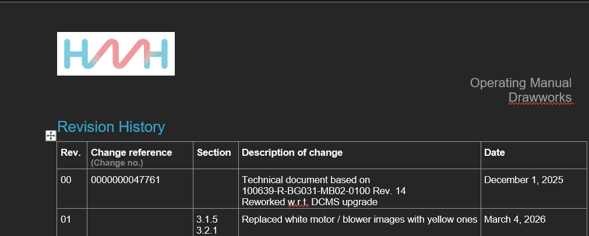

## Find document
### With Document number
Paste Document number into search field in the right top corner
select the document from the list of matches
click on content and select the document with the number you searched for in the "attachments" area

### With Rig Name
Use the List to find the Rig in question and copy the Part-No of the equipment from col "Part in Product container"  
[Link](https://hmhw.sharepoint.com/:x:/r/sites/EngineeringTeam/Shared%20Documents/General/15_Doku_Allg/00_Documentation%20Parts%20in%20Windchill/Documentation%20Parts%20for%20Projects%26Upgrades%20in%20Windchill.xlsx?d=w905cc37a53354f1daa1fc4a95f7bd160&csf=1&web=1&e=cacytD)  
In the tab "Related Objects" in the section "Reference Documents" you can see all documents to the equipment  

## Update document
Open the document  
In the top left corner click "Actions" -> "New" -> "New Change Rquest"

### Open Change Request
Follow the steps
### Open Change Notice
Follow the steps
  
Adding a reviewer into the process will not send a notification to that person.  
So make sure to talk to the person in order to get the review done!

### Checkout Document
1. Make changes
2. Update Revision History

### Create new Documents
- Neue Dokumente erstellen
	- Immer das Template "Windchill Generic" benutzen und dann die Infos aus dem korrekten Template raussuchen

