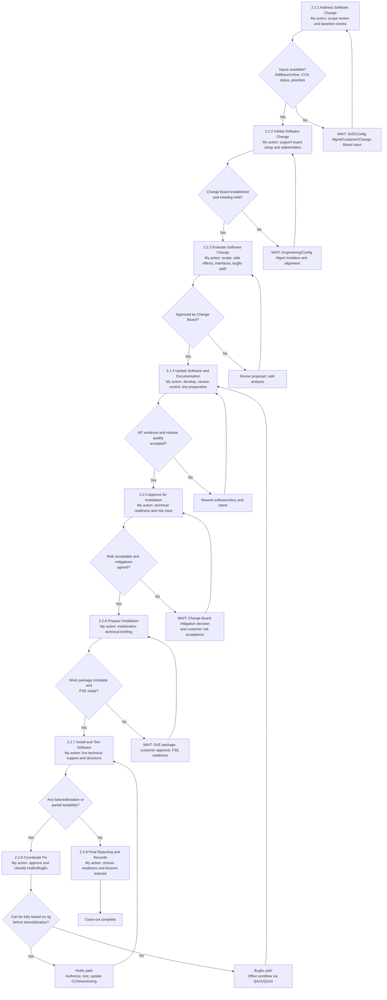

# Software Engineer Duties in QA21 / QA21-2

This note summarizes my duties as a software engineer across the QA21 process, with clear checkpoints for when I act and when I must wait for inputs or approvals from others.

## 0a) Process flow

## 0b) Checklist

Use this checklist for each project in process order. Keep the order strict so later steps are only checked once earlier steps are complete.

### Process Checklist

- [ ] Wait for: SVE/customer request and scope basis
- [ ] Request received and scope understood
- [ ] Wait for: Octoplant backup/release data from SVE or Configuration Management
- [ ] SWBaseOnline and SWBaseRelease checked
- [ ] Wait for: release history and current rig status from SVE/Configuration Management
- [ ] Open CCNs and version mismatches reviewed
- [ ] Wait for: Change Board/Technical Responsible input if scope is unclear
- [ ] CCN established or updated
- [ ] Wait for: final CCN scope and required documents from SVE
- [ ] Work Package folder created
- [ ] Wait for: Engineering/Configuration Management to set up the meeting
- [ ] Change Board established and invited
- [ ] Wait for: Change Board discussion, third-party input, and customer/SAM/KAM alignment if needed
- [ ] Scope, side effects, interfaces, and third-party impacts reviewed
- [ ] Wait for: formal Change Board decision
- [ ] Change approved or rejected by Change Board
- [ ] Wait for: approved scope and any missing technical input from Technical Responsible
- [ ] Software and documentation updated
- [ ] Wait for: test environment, Configuration Management participation, and any required evidence
- [ ] Internal tests / IAT completed
- [ ] Wait for: test completion and Change Board/customer risk acceptance if required
- [ ] Installation readiness approved
- [ ] Wait for: SVE invitation, FSE readiness, and customer/technical attendance if needed
- [ ] Mobilization meeting completed
- [ ] Wait for: installation start window and rig access
- [ ] Recovery backup created
- [ ] Wait for: FSE execution, customer witness/permission, and Technical Responsible support if needed
- [ ] Software installed and tested on rig
- [ ] Wait for: customer witness and completed test record
- [ ] Customer signatures collected
- [ ] Wait for: successful installation/test completion
- [ ] SWNewOnline created
- [ ] Wait for: final installed version confirmed
- [ ] RDPC updated if applicable
- [ ] Wait for: all signed documents and backup software from FSE
- [ ] Software and signed documents sent to SVE
- [ ] Wait for: issue classification and Technical Responsible / Change Board approval as required
- [ ] Fixes / hotfixes / bugfixes handled and documented
- [ ] Wait for: final documents, uploads, and confirmation from SVE/Configuration Management
- [ ] Close-out and post-job briefing completed

### Project Notes

- Project:
- Rig:
- CCN:
- SWBaseOnline:
- SWBaseRelease:
- SWNewRelease:
- Planned install window:
- Main risks:
- Open questions:
- Next action:

## 1) My role context in QA21

As a software engineer, I can be involved in one or more of these roles:

- Technical Responsible (or software engineer authorized by SME)
- Change Board member (engineering representative)
- Support to SVE during planning, I&C (Installation & Commissioning), and close-out
- In some cases: software engineer authorized by Configuration Management

Core accountability when acting as Technical Responsible:

- Produce and provide software and documentation according to CCN and procedure
- Provide timely technical support and approvals during installation/service mission
- Quality assure CCN filling and handling
- Approve any software change before implementation (including hotfix path)

## 2) End-to-end process duties (act vs wait)

## Step 2.2.1 - Address Software Change

What I do:

- Review request and technical scope basis from QA21 change request/CCN context
- Support validation of software baseline logic (SWBaseOnline vs SWBaseRelease)
- Help define technical options if version mismatch or open CCNs exist
- Provide engineering input for implementation plan alternatives

When I wait for input from others:

- SVE/Configuration Management to confirm latest backup availability in Octoplant
- Change Board decision on accepted baseline and release strategy
- SAM (Service Account Manager)/KAM (Key Account Manager) and customer alignment on sequence/priorities

## Step 2.2.2 - Initiate Software Change

What I do:

- Participate in Change Board setup and kickoff preparation
- Clarify impacted applications, side effects, interfaces, and deliverables
- Confirm which technical stakeholders must attend (including third-party support)

When I wait for input from others:

- Engineering/Configuration Management to send formal board invitation
- SVE/SAM/KAM for commercial and installation-window constraints

## Step 2.2.3 - Evaluate Software Change

What I do:

- Review and refine technical scope in CCN
- Identify side effects across products/systems and interfaces
- Assess third-party control impacts and required consultations
- Evaluate multi-release requests and technical feasibility
- Propose, recommend, or reject technical solutions in Change Board
- Assess compliance impact (certificates/declaration of conformity)
- Reuse lessons from past CCNs and NCRs
- Classify issue path: normal change, bugfix, or hotfix candidate

When I wait for input from others:

- Change Board approval before any software change starts
- Third-party confirmation where external logic/systems are affected
- Project Manager/SAM/KAM confirmation if scope/cost/time assumptions change

## Step 2.2.4 - Update Software and Documentation

What I do:

- Develop/update software according to QA24 and approved CCN
- Keep one controlled release path and maintain version discipline
- Update required documentation (test procedures, user docs, CCN details)
- Support/execute internal integration testing and review test evidence quality
- Ensure bugfix workflow follows approved path and procedure

When I wait for input from others:

- Configuration Management participation in IAT and process quality checks
- SVE for customer-specific delivery requirements and deployment constraints
- Change Board/Configuration Management if release acceptance is challenged

## Step 2.2.5 - Approve for Installation

What I do:

- Verify technical readiness: software release integrity, test completeness, documentation quality
- Contribute to risk evaluation (complexity x test coverage) and mitigation definition
- Approve or reject installation readiness from technical perspective
- Ensure CCN is complete for implementation decision

When I wait for input from others:

- Change Board decision on mitigation when risk is high
- Customer risk acceptance where contract/process requires it
- SVE confirmation that install package and planning prerequisites are complete

## Step 2.2.6 - Prepare Installation

What I do:

- Join mobilization meeting (QA108) and provide technical briefing
- Clarify software handling, installation sequence, and support model
- Define required passwords/access prerequisites and fallback contacts
- Confirm test boundaries and mandatory tests before software can remain online

When I wait for input from others:

- SVE to distribute complete work package and coordinate mobilization
- Customer approval package/sign-off when required
- FSE availability and readiness confirmation

## Step 2.2.7 - Install and Test Software

What I do:

- Provide real-time technical support during installation/testing
- Approve technical decisions during deviations/failures
- Decide on go-forward vs rollback recommendation with SVE/FSE
- Confirm acceptability when tests are partially executable offshore

When I wait for input from others:

- FSE to execute installation, tests, evidence collection, and signatures
- Customer witness/signature and operational permission
- SVE escalation to Rapid Response when urgent out-of-hours support is needed

## Step 2.2.8 - Coordinate Fix (Hotfix/Bugfix)

What I do:

- Approve any software change before implementation (mandatory)
- Determine whether issue qualifies as hotfix or bugfix path
- If hotfix: provide clear instructions or authorize competent FSE
- Ensure version numbering follows SF01-0009 and CCN traceability (category F for hotfix)
- Ensure latest official release eventually includes approved fix (QA24 path)

When I wait for input from others:

- Change Board alignment for complex cases or competing release paths
- FSE to test hotfix fully on rig before demobilization
- SVE to update CCN details and store resulting software in Octoplant

## Step 2.2.9 - Final Reporting and Records Management

What I do:

- Review post-job technical outcome and confirm closure readiness
- Evaluate whether fix applies to other open CCNs/rigs and whether alert is needed
- Support lessons learned and recurrence prevention actions

When I wait for input from others:

- SVE to gather/upload signed reports, software, and attachments per QAW21-8/QAW21-13
- FSE to submit complete mission records and SWNewOnline
- Configuration Management/SVE to complete formal close-out workflow

## 3) Non-negotiable rules I must enforce

- No software change without prior Technical Responsible approval
- No shortcuts on password checks/peer review unless explicitly allowed by QA24 and approved
- Only one controlled software release path at a time unless formally evaluated and approved
- Full traceability in CCN for planned and completed actions
- If fix cannot be fully tested offshore before demobilization, treat as bugfix (not hotfix)

## 4) Practical "act or wait" trigger list

Act immediately when:

- A technical scope ambiguity, side effect risk, or interface conflict is identified
- FSE reports test failure, unexpected behavior, or customer disapproval
- A hotfix request is raised during installation/testing
- Versioning/traceability risk appears in CCN or release package

Wait (and do not proceed) until input/approval is received when:

- Change Board approval is pending
- Customer approval/signature is required by process/contract
- Third-party control-system impact is identified but supplier alignment is pending
- Evidence/testing is incomplete for the chosen path

