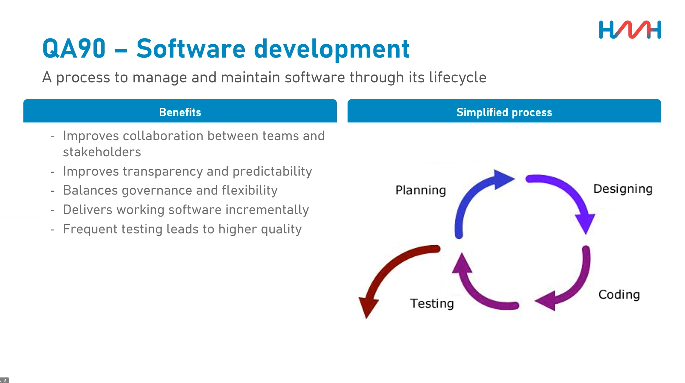
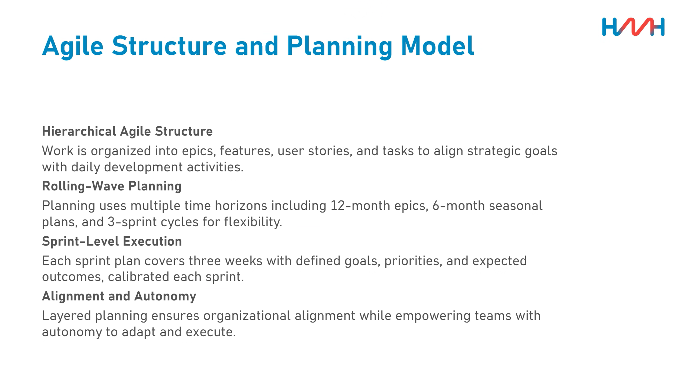

#
Date 15.04.2026

## QA90 Software developement
- sort of paralle to QA24
- 
- QA24 more for projects
	- code specific to project
- QA90 more for product that are constantly evolving
	- generic code for many machines etc.
- definition of when to use QA24 rather than QA90 is in the making but does not exist yet
- 
## QA21 Software Changes
- SME -> Subject Matter Expert
	- The responsible SME can be found in OctoBI
- Process flow chart in the document
## QA24 Software Development and Release
- Dont be afraid to release a new version number
- DO NEVER use a version number twice!
- Use Quick-Save / commit+push regularly in order to not lose any work on broken laptops
 
## QA24-1

