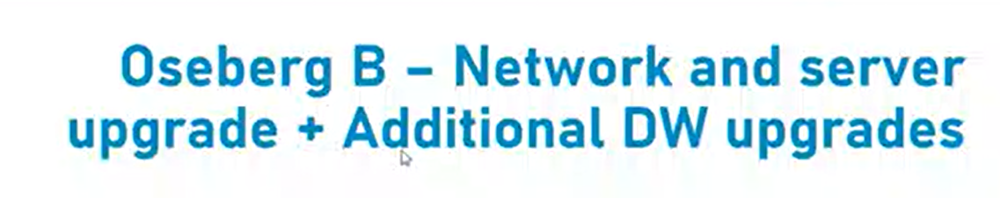
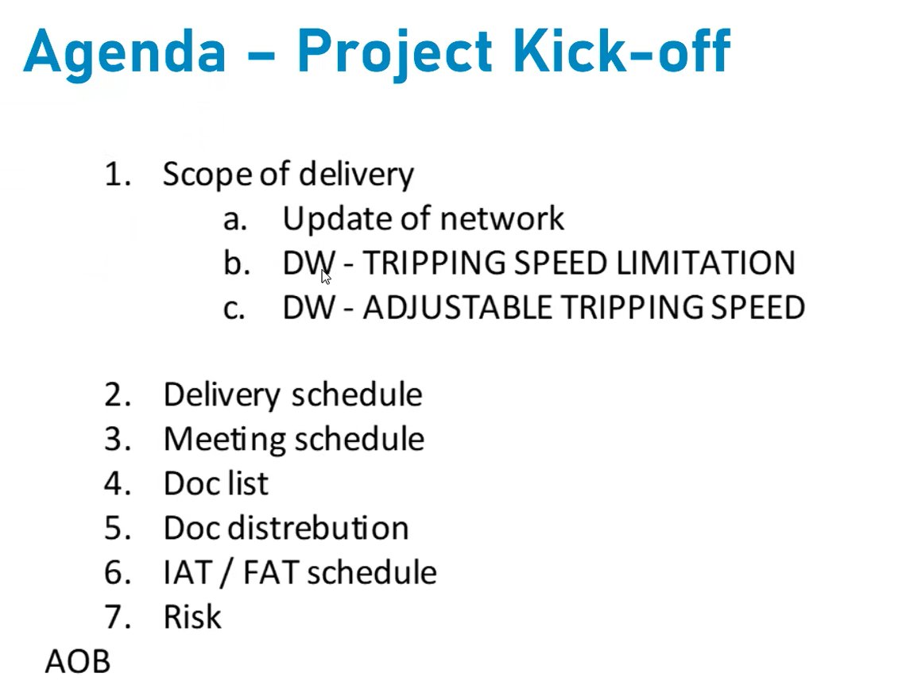
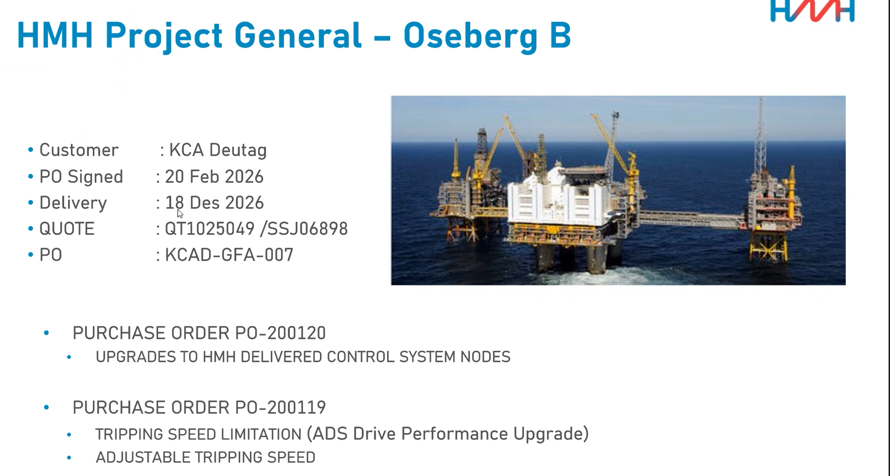
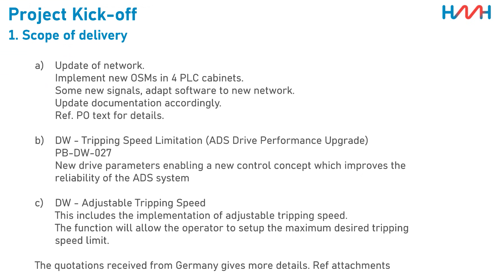
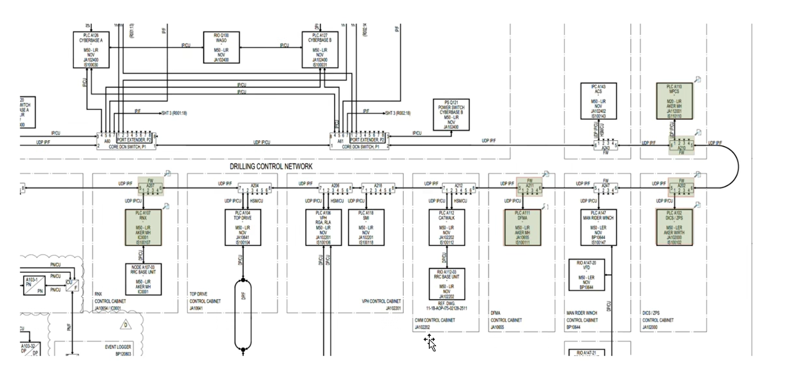
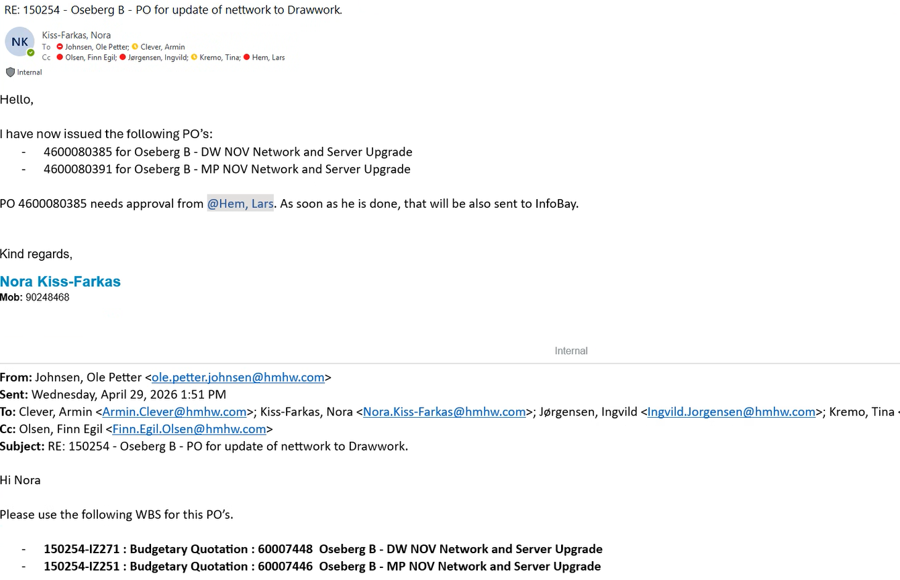

# Meeting 12.05.2026
Date: 08.06.2026  
Time: 13:00  

## Participants
André Burke  
Finn Egil Olsen
Holger Jansen
Hans Klouman
Bogdan Dumitrache
Kjell Olav Haland
Preben Gundersen

## Content
- Drawworks Updaate
- Scalance switches will be replaced
- New Anti-Collision System requires our machine to send a few signals to the system
- Drawings availbel in projects folder
- All Network devices that can be monitored for faults must get an error message in case of failure
- 

# Meeting 12.05.2026
Date: 12.05.2026  
Time: 14:00  

## Participants
André Burke  
Karel Alles  
Achim Braml  
Bogdan Dumitrache  
Ole Petter Johnsen  
Finn Egil Olsen

## Content

- Replacement of Drawworks Siemens Scalance Switches
- Chair Buttons
- New functionality for Drawwork
- Tripping speed limitation
- was oder wer ist NOV? Customer maybe? www.nov.com - national oilwell varco
- NOV will prepare some documents per PLC for us???
- Some test-hardware in Stavanger, not a full Simulator
- SMDL???
- wich documentation is affected by what?
- 
- green PLC will be affected by DCMS upgrade
- Karel macht DW
- Ich mache Mudpump
- Scope of Work document
- DICS PLCs must be changed, as original model is not available anymore directly via Siemens
- Do we have access to all shared documents regarding this project?
- IAT & FAT with Hardware in Stavange
- Project Documents: https://hmhw.sharepoint.com/:f:/r/teams/SPSMHWirthProjects/Project%20Document/150254%20-%20Oseberg%20B%20-%20Network%20and%20Server%20upgrade/09%20-%20Document?csf=1&web=1&e=fuEZcb
- 
- IAT can be tested in our office
	- when? no clue yet
- time for the FAT
	- 2h
- what is the cyberbase?
- 

