## Header
- CCN 118
- octoplant
    - 12807698-WestWhiteRose
        - 12807770-RT1
- documents
    [Hydraulics](../XX01_DrawingsAndHydraulics.pdf)

## Password protection
1. open HW config
2. double click RTCS
3. 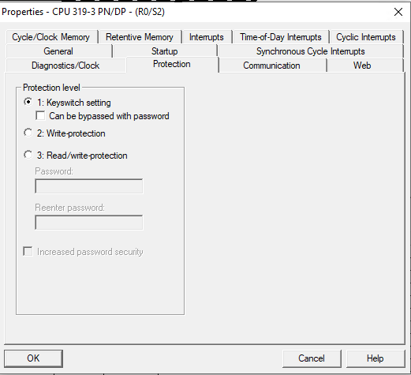
4. Software Version erhöhen
    - OB100
    - net 2
    - Version um 1 erhöhen
    - 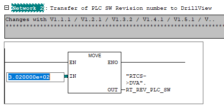  
    - rein internes update, Block version bleibt bei 1.5
5. Passwort in PAM erstellen
6. Passwort in S7 einfügen
    - 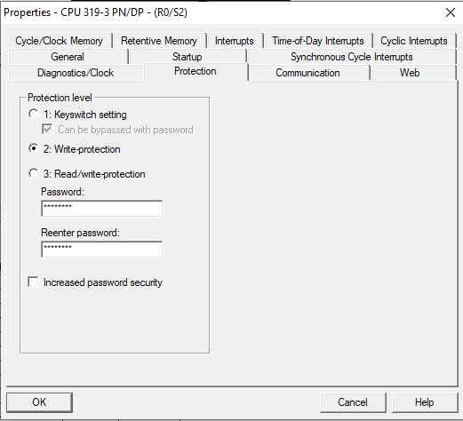  
7. Hardware kompilieren
    - 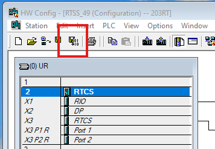  

## Frames Test Procedure
1. 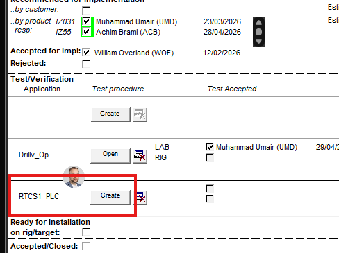
2. 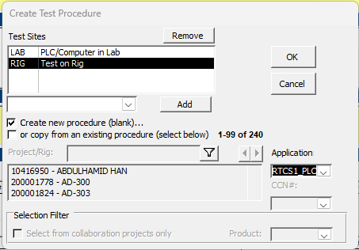
3. OK
4. 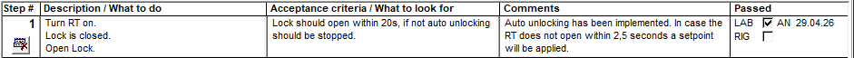
999. 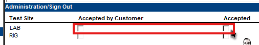

## Step 7 indepentent rung error
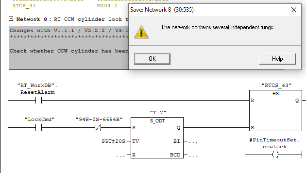

## VM not connecting to Sim
my pc  
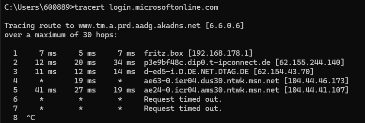  
my vm  
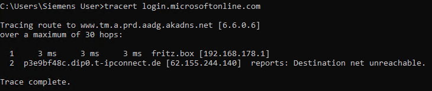  

## Code Review 27.04.2026
- in OB100 die Software-Version aktualisieren
- _ProjectCV
    updaten
- in jedem Block müssen die Object Properties (versions nummer) angepasst werden
    - rechtsklick -> object properties -> reiter "General - Part 2" -> Version
- CCN Nummer in jeden Header eines geänderten FB
- Der changelog eines FB immer in den Header vom FB. Nicht in den comment zu Net1!
- für den simulator kein Passwort für die Hardware konfig
    - in die HW
    - CPU doppelklick
    - reiter Protection
    - 1: Keyswitch setting + haken entfernen
    - Das passwort wird neu eingerichtet, wenn die Software wieder in DLS abgelegt wird.

## ToDos
### Process
- Test Proc schreiben
    - In Excel
    - in Frames nachschauen, wie das aufzubauen ist  
    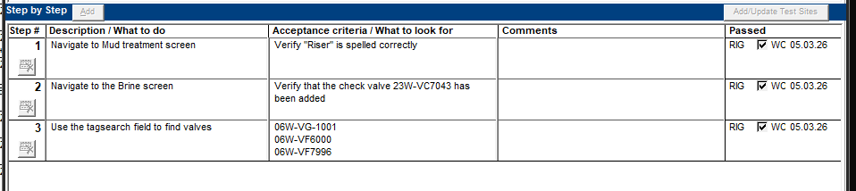
### Programming
- [ ] Neue Alarm-Bits 47/48 in DV einbinden
- [ ] Wenn Locking länger dauert. Dann Unlock gedrückt wird. Muss lock abgebrochen werden und unlock ausgeführt werden
- Verhaltensweisen implementieren:
    - [test] Gear lock open nur erlaubt, wenn CW, CCW oder free vorgewählt
        "CCW_RotationAct"  
        "CW_RotationAct"  
        "FreeRotOn"  
        - ist disabled bei I_xColor_4
        - "TouchPanel_Color_Flex" schreibt den letzen aktiven Wert auf den Ausgang
    - [nope] Speed Inc nur erlaubt, wenn lock open
        - ergänzend um Fehlermeldung aus dem Weg zu gehen: nur erlaubt, wenn TRQ != 0
        "RT_Unlocked"  
        "RT_WorkDB".Torque_SP (REAL) [0..100%]  
        ! Hier kann ein Deadlock entstehen, wenn die Unlock Seq nicht erfolgreich ist und der Operator keine Möglichkeit zum Eingriff hat
    - [test] Gear Lock close nur erlaubt, wenn Speed Zero
        "SpeedZero"
        - Funktion bereits vorher vorhanden. Aber nicht ersichtlich
    - [test] Speed Dec nicht erlaubt, wenn Speed Zero
        "SpeedZero"
    - [ ] reicht das Änderung der Button Farbe aus, damit das HMI keine Inputs mehr durchlässt?
        - [ ] wenn SEQ aktiv, darf kein CW, CCW, Free befehl durch kommen
    - [ ] Direction von vor der Seq wird wiederhergestellt
#### Done
- [x] Simu erweitern um einzelne Unterdrückung der proxies pro lockpin

## Colors for OC Buttons
### Taken from official doc SA21 (ODN1)
|Meaning|Pressability|bg color|text color|hex val|dec val|var name|
|---|---|---|---|---|---|---|
|off (DEFAULT)|pressable|dark blue|white|0|0|T_iGrey|
|on|NOT pressable|blue|grey, bold|a8|168|T_iLightGreen|
|busy|NOT pressable|light blue|black, bold|1e|30|T_iMagenta|
|busy|pressed|light blue|black, bold||30|T_iMagenta|
|off|NOT pressable|dark blue|grey, bold|80|128|T_iLightGrey|

## PLC test cases
1. OK | is OPEN | CCW | block lock | lock | unblock lock when rt moving | after SEQ must be CCW
2. geht nicht. Closed & free ist nicht erlaubt | is OPEN | FREE | block lock | lock | unblock lock when rt moving | after SEQ must be FREE
3. OK | is CLOSED | CCW | block unlock | unlock | unblock unlock when rt moving | after SEQ must be CCW
4. geht nicht. Closed & free ist nicht erlaubt | is CLOSED | FREE | block unlock | unlock | unblock unlock when rt moving | after SEQ must be FREE

## Test cases
|Description|Acceptance Criterea|Test Success|
|---|---|---|
|Turn RT on. Lock is closed. Open Lock.|Lock must open within 10s.|y|
|Lock is open. Close Lock.|Lock must close within 20s. If locking takes more than 2.5s a message should appear  that Autolocking is active|y|
|Lockpins are not triggering neither open nor closed state prox switch. Close Lock.|Lock must close within 20s. If that does not work, RT will be turned off. A message will appear, that autolocking was not successfull|y|
|Lockpins are not triggering neither open nor closed state prox switch. Open Lock.|Lock must open within 10s|y|
|Turn RT off.|Free rotation and prop valves must be unpowered (freeRotation HY-6657) (prop valves get their values directly from RT_WorkDB.Speed_SP) (trqCtrl HY-6652)|y|
|Open Lock. Turn RT off.|AutoLockUnlock sequence must execute before RT_Off.|y|
|Lock the RT. Jam the Lockpins in Locked position. Unlock. (sim only)|AutoUnlock should rotate the table in order to set pins free. After 20s a timeout error message should appear|y|
|Unlock the RT. Jam the Lockpins in Unlocked position. Lock.|AutoLock should rotate the table in order to make the pins reach their slots. After 20s a timeout error message should appear|y|
|Make sure RT is on and unlocked. Request "All machines off"|Autolock sequence must start. RT should be off latest after 20s|y|
|Make RT rotate. Use E-Stop|RT must stop and turn off||
|Use E-Stop while RT not rotating|RT must turn off immediately||
|||

- quick stop (wie shutdown bei PLCimple. ramp down. stop. maybe lock)
- test all machines off
- 

- step7
    - doku
        - änderungs historie für FC13
        - nur major.minor, kein Patch
            - das was im netX wie patch aussieht, ist die fortlaufende Nummer aller änderungen
        - im project CV
            - Änderungen aufteilen in Sources / Blocks
                - in den sources den Dateinamen verwenden
        - in octo
            - unter changes: "DEVELOPMENT CCN xxx, ccn name"
            - 
- version von Andi nehmen, projekt umbenennen, nach octoplant hochladen "Namen geändert"
- Umair, Muhammad fragen ob er oder ich die DV meldungen anlegt

- Dokumentation

#### Attachments
1) Might not happen due to C13 net2  
    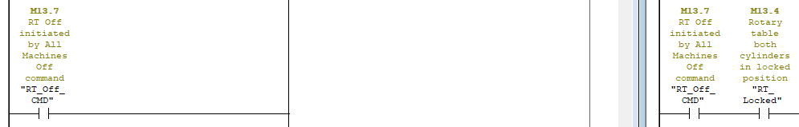  
    Maybe there needs to be a delay after RT_Off_CMD in order to have AutoLockUnlock finish

## Files
[WWR-Connect](WWR-Connect.md)  
[WWR-PLC](WWR-PLC.md)

## ~~Fragen~~ Antworten
17.03.2026
- DeepseaHercules RT
    - wie finde ich heraus, wo ein FB "lebt" hier z.B. FB6
        - Bei mhWirth:
            - Der oberste FB im Ordner gehört immer direkt zum DB im Ordner.
            -  das ist das falsche BILD!
            - Der Inhalt von DB9 & FB6 sind identisch
                - DB9 hat nicht eine "Wohnung" in der FB6 lebt.
                - DB9 ist das Einfamilienhaus von FB6
                - FB5 lebt nicht in DB9, sondern in FB6!
    - was macht FB32.sAutoFunctionStartDelay? Warum gibt es hier keine Kommentare für den Anwendungsfall, sondern nur für den allgemeinen Baustein aus der Lib
    - was machen FB32.sOpen / sClose?
        - vermutlich geben sie das Anforderungssignal in den FB32
        - Wie kann ich die Aufrufe finden?

## timeline
17.03.2026
- Sollte Donnerstag fertig sein
    - Inkl Red-Dot-Korrektur
    - Programm-Anpassung 
    - Test Procedure
- Autolock Sequence
    - anschauen in anderem Programm. 10157547 DeepseaHercules
    - Ablauf
        - RT steht
        - Lock Befehl wird durch Operator gegeben
        - Lockpins ausfahren
        - Auf Endlage warten
        - Wenn Endlage:
            gut.
        - Wenn keine Endlage innerhalb von X dann:
            Torque vorgeben
            Drehzahl vorgeben
            Wenn Lock erfolgreich:
                gut
            Wenn Lock nach 20 Sekunden nicht erfolgreich:
                Meldung
    - Notaus unterbricht Sequence
10.03.2026
- 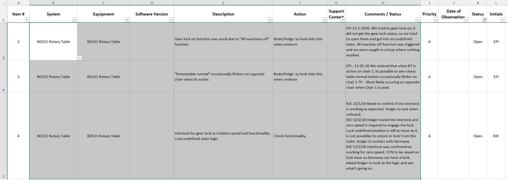
- Step7 software is now in octoplant under rigs/westwhiterose.../rt...

16.02.2026
WestWhiteRose (2):  
    RT (rotary table)  
    Classic PLC  
    Lockpins  
    sicherer status für den drehtisch ist locked  
        erst dann durfte die maschine ausgeschaltet werden  
    timeout nach 20 sek wenn lock nicht klappt  
        dann trotzdem aus  
        dieses timeout gibt es in der software dieser maschine noch nicht  
    muss in FUP/KOP nachprogrammiert werden  

