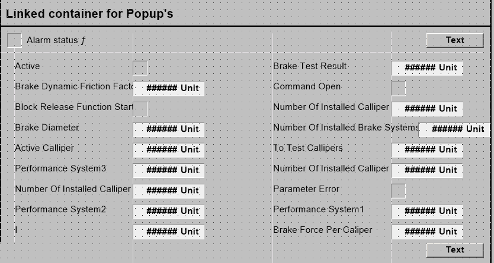

## Fragen
- Wie gehe ich diesem Fall um?
	- 

## Erkenntnisse zu .ctx files
- Schriftgrößen werden in Punkten * 20 gespeichert
- Positionsangaben werden in Punkten * 20 gespeichert
	- Ein Feld
		- mit den Eigenschaften
			- Top 532
			- Left 765
			- Width 90
			- Height 18
		- wird gespeichert als Rect
			- 15300 (left)		(Left(765) * 20)
			- 10640 (top)		(Top(532) * 20)
			- 17100 (right)		(Left(765) + Width(90) = 855 | 855 * 20)
			- 10280 (bottom)	(Top(532) - Height(18) = 514 | 514 * 20)
- Wenn eine
	- .cim direkt geöffnet und als .ctx gespeichert wird
	- dann ein Feld um 1pt verschoben wird
	- die Datei dann erneut als .ctx gespeichert wird
	- weisen die beiden .ctx Dateien deutliche Unterschiede auf, auch wenn das Verschieben wieder rückgängig gemacht wird.
	- wenn aber nun ein Feld verschoben wird, sind nur noch Unterschiede an der Stelle des verschobenen Feldes vorhanden
		- betrifft das auch die .cim Dateien? -> NEIN
- In der .ctx Datei befinden sich verschachtelte Elemente
	- hier ein Beispiel für einen Text ("Active") mit einem Anzeigefeld (Typ Lamp) dahinter:
		- (GmmiTextObject [...] (Point 5760 12200) "Active")
			- (Point X Y) beschreibt wo der Text steht
		- (GmmiLinkContextFrameObject [...] "[...]ClassLamp" [...] (Rect 8760 12200 9120 11840))
