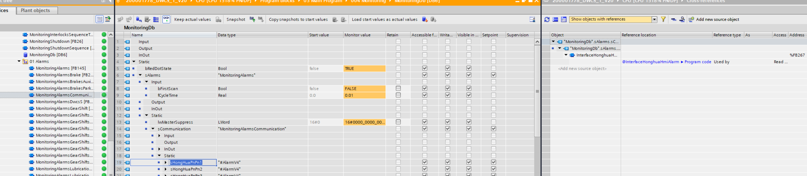
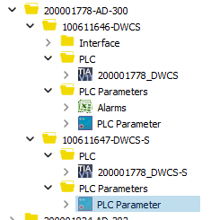
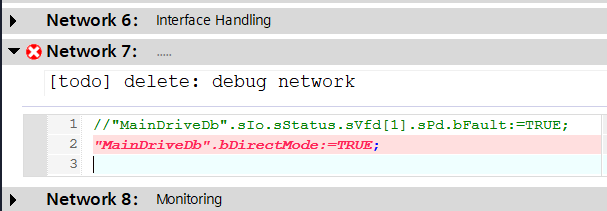
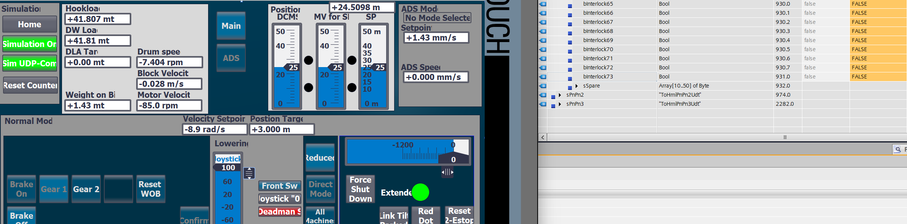

16.02.2026
## Questions
1. Wie komme ich zum Aufruf eines FB, wenn ich seinen Speicher im DB gefunden habe, wenn in den cross-references kein call angezeigt wird:
	- 
	- Warum wird kein call angezeigt?
2. KnowledgeBase/manuals/s7/plcimple/plcimple.md -> zu Frage 3: warum lebt das Object von ST_AlarmHmiInterfaceV4 nicht in FB_AlarmV4. Warum gibt es hierfür 2 DBs?
## Setup
- Zur Verfügung stehen 2 S7 im Labor
	- 1x 1500
	- 1x 1500F
	- Ixon5
	- PN/PN Koppler
- Zu verwendende Software-Projekte
	- Projekt AD-300  
	
- IPs
	- CPU 192.168.100.9
	- Ixon ...99
	- Hmi ...209
	- chair ...2
	- Safety CPU
		- X1: 192.168.0.1
		- X2: ...6
## Tasks
- [x] TIA 17
	- Software siehe oben
	- inkl HMI
	- Downgrade der Firmware Version der S7 auf 2.9.4
		- auf der TIA Seite im Sharepoint zu finden
	- Software übertragen
- [x] TIA 20
	- [ ] Firmware Upgrade
		- [x] PLC
		- [x] HMI mit ProSave möglich
		- [x] Safety PLC
	- [x] Programme laden
		- [x] PLC
		- [ ] HMI (nicht möglich durch mich, da auf meinem Rechner die WinCC Installation mit den Images fehlt!)
		- [x] Safety PLC
- [x] Verbindung mit PN/PN herstellen
	- Settings
		- X1
			- IP: 192.168.5.20
			- Name: DWCS-S1, IC0008-KF05.X1
		- X2
			- IP: 192.168.6.2
			- Name: DWCS-S1, IC0008-KF05.X2
	- erstmal selber probieren
	- ggf. später den DWCS Guide aus der Einarbeitungsliste lesen
		- Kapitel "Profinet device name Zuweisung"
- [x] Simulation
	- [x] Im Test-HMI Simu aktivieren
	- [x] Im Test-HMI UDP aktivieren
- Alle Tests in diesen Dokumenten aus dem CCN durchfahren:  
	-   
		1. [x] Im DWCS Support Document steht, dass alle CPUs bis auf F-CPUs mit Firmware 2.9.4 laufen sollen. Warum ist dann im Labor FW 3.x drauf?
			Für ein Projekt wurde auf 3.1 gesetzt. Normal ist weiterhin 2.9. Außer für die neuesten CPUs, die nur noch ab v4.x laufen.
		2. [ ] Welche Values? Oder einfach "viele"? Manche Werte werden im weiteren Verlauf des Dokuments ja noch separat abgefragt
			- Ich als Programmierer des ganzen weiß welche Werte neu/angepasst sind. Der Kollege vor Ort weiß das nicht
		3. neue Felder in alter Software nicht sichtbar. "Average ROP" zeigt immer "-0.0 m/h". Und jetzt?
			- DB21: DrillViewInterface.sTo.sPosition.sVelocity.fRopAverage kommt aus
				- PositionDb.sIo.sVelocity.sRateOfPenetration.fAverage
				wird nur gelesen, nie geschrieben!
				- [ ] Wie würde ich das fixen?
					ROP Value ist vorhanden im HMI. Diesen Wert kann ich also zur AVG Bildung heranziehen.
					Über welchen Zeitraum soll der avg gebildet werden?
					Besondere Anforderungen an Algorithmus?
					floating avg?
		4. "All values indicated correctly" meint
			Werte vorhanden?
			oder Prozessbezogen plausible Werte vorhanden? Dann müssten alle Modi gefahren werden um das zu verifizieren
			Wenn da überall "0" steht und manche Werte auch während des bohrens "0" bleiben ist das ja wenig Zielführend!
			Da ich gerade nur das HMI teste, könnte ich die Werte auch in der PLC setzen / forcen. Da es alles HMI Variablen sind, sollten diese Werte nirgendwo sonst Einfluss auf die Maschine haben. Korrekt? Kann ich Werte überhaupt forcen?
		12. - [x] Wie löse ich PLC seitig Alarme aus?
				Im OB34 nach "Interface Handling" und vor "Monitoring" ein Netzwerk einfügen. Hier dann die Alarmbedingungen auf TRUE schreiben
		14. - [ ] Wo ist der? MonitoringDb.sPosition.sPowerLimitation?
	-  
		5. [ ] pending
			- Direkter Zugriff auf MainDriveDB Aufgrund von Optimierung scheinbar nicht möglich
				- 
				- Ich habe das Netzwerk in der falschen Sprache erstellt. Daher die Meldung über den Syntaxerror! 
			- [ ] MainDriveDb.sIo.sStatus.sVfd[1].sPd.bFault
			- [ ] MainDriveDb.sIo.sStatus.sVfd[1].sPd.bAlarm
			- [ ] MainDriveDb.sIo.sVfd1.sCounter.bCommTimeout
			- [ ] MainDriveDb.sIo.sStatus.sVfd[1].sData.sWord2.bLockOutSwitch
			- [ ] MainDriveDb.sIo.sStatus.sVfd[2].sPd.bFault
			- [ ] MainDriveDb.sIo.sStatus.sVfd[2].sPd.bAlarm
			- [ ] MainDriveDb.sIo.sVfd2.sCounter.bCommTimeout
			- [ ] MainDriveDb.sIo.sStatus.sVfd[2].sData.sWord2.bLockOutSwitch
			- [ ] MainDriveDb.sIo.sBrakingChopper1.sStatus.sPd.bFault
			- [ ] MainDriveDb.sIo.sBrakingChopper1.sStatus.sPd.bAlarm
			- [ ] MainDriveDb.sIo.sBrakingChopper1.sCounter.bCommTimeout
			- [ ] MainDriveDb.sIo.sBrakingChopper2.sStatus.sPd.bFault
			- [ ] MainDriveDb.sIo.sBrakingChopper2.sStatus.sPd.bAlarm
			- [ ] MainDriveDb.sIo.sBrakingChopper2.sCounter.bCommTimeout
			- [ ] MainDriveDb.sIo.sBrakingChopper3.sStatus.sPd.bFault
			- [ ] MainDriveDb.sIo.sBrakingChopper3.sStatus.sPd.bAlarm
			- [ ] MainDriveDb.sIo.sBrakingChopper3.sCounter.bCommTimeout
			- [ ] MainDriveDb.sIo.sBrakingChopperStatus.bTooManyChoppersNotUsable
			- [ ] MainDriveDb.sIo.sBrakingChopper1.sResistorTemperatureLimits.bHi
			- [ ] MainDriveDb.sIo.sBrakingChopper1.sResistorTemperatureLimits.bHiHi
			- [ ] MainDriveDb.sIo.sBrakingChopper2.sResistorTemperatureLimits.bHi
			- [ ] MainDriveDb.sIo.sBrakingChopper2.sResistorTemperatureLimits.bHiHi
			- [ ] MainDriveDb.sIo.sBrakingChopper3.sResistorTemperatureLimits.bHi
			- [ ] MainDriveDb.sIo.sBrakingChopper3.sResistorTemperatureLimits.bHiHi
		6. [ ] Test fehlgeschlagen
			- [x] 1 Main-motor per HMI deaktiviert
			- [ ] ToHmiDb(DB39).sPnPn1.sInterlocks.bInterlock73 // DWCS: Velocity limited by reduced motor operation
			- 
		7. [ ] noch unklar, wie das zu realisieren ist.
			- [ ] Einstellung über HH-Screen Variablen funktioniert nicht
				- Hook Load Limit kann scheinbar nur über HH-Screen aktiviert werden. Zum Testen setze ich daher die Variable
				- FromHmiDb(DB38).sPnPn1.sOc.sData.bCommand20 // DW Load Limitation Active from OC
					- set to TRUE
				- FromHmiDb(DB38).sPnPn1.sOc.sData.fLoadLimitationValue // SW Load limit value (mt)
					- set to 20.0
			- [ ] Einstellung der Load Limitation über TestHMI -> Settings
				- IN := 20.0
				- Active := TRUE
				- [x] Da die Hookload in der Simu dauerhaft um die 43.1mt steht, lässt das Limit generell kein Hoisting zu. Warum muss das umschwenken von Lowering nach Hoisting im speziellen überprüft werden?
					- Beim Umschwenken von lowering -> hoisting, übernimmt der Algorithmus für Hoisting u.U. schon vor dem Stillstand der Trommel.
	-   

