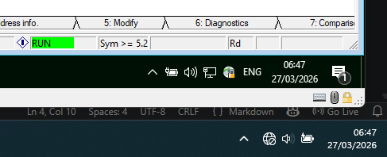
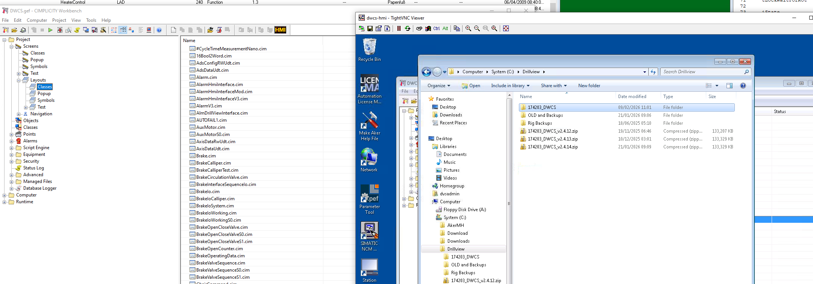
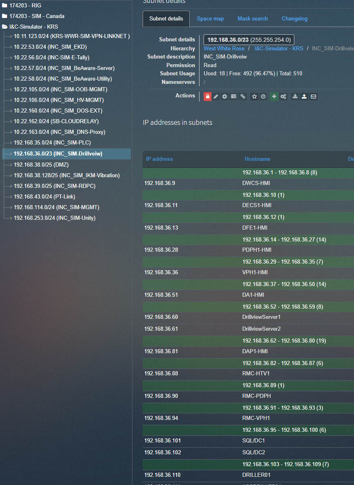
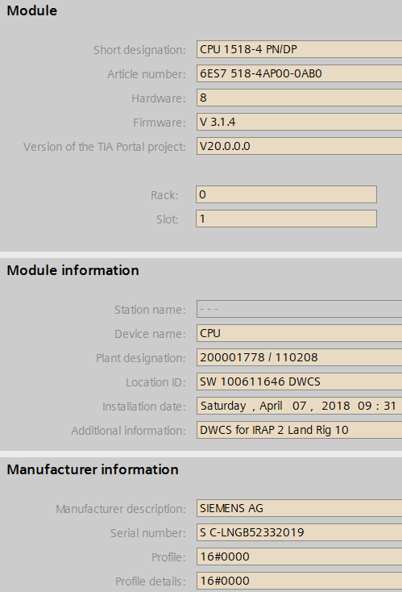
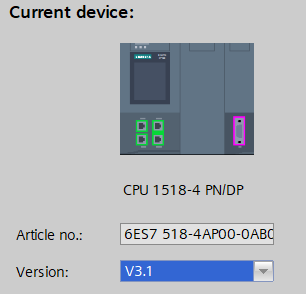

03.06.2026 Tags: [AI][Guide]
- Tell AI to fix itself. tell it what the mistake is. tell it the correct answer. ask why it made a mistake. edit skill/memory to not make that mistake again
- pandoc can convert documents into markdown
- give examples to the AI to get better results

- is there a central repository for HMH AI Skills?
- awesome-copilot site (ie create implementation plan)
- read skill files before using
- traceablity is non-negotiable. ask for sources/cites
- learn how to use skills for AI Agents
- use phase implementation plan
	- one chat per phase
- 

27.03.2026
- Homeoffice Internet Issues
    - 

23.03.2026
- DV Login
    - user: DVSAdmin
    - pw: dvs100
- tight vnc 3d simulator (pc game)
- WestWhiteRose 192.168.253.10
- pw: TV12014!

19.03.2026

meinen Cimp Ordner auf dem Sim PC in Drillview kopieren, nachdem 174203_DWCS gelöscht wurde

V1.4.1 / Burke / 19.03.2026
Issue: Auto lock does not work.
1. Added CW / CCW Rotation on request from FB51 "LockUnlockSequence"

12.03.2026
## guide simu
[ProFace](KnowledgeBase/Manuals/Software/Pro-Face/Pro-Face.md)
### connect to PLC
- Step7 - Options - Set PG/PC Interface
    - Select Cisco Anyconnect ... TCPIP.1
### connect to DrillView
- tighVNC
- connect to DRILLER01
- 

18.02.2026
- [x] Kann ich mit TIA 20 per Ixon auf die Geräte drauf?
    Es gibt keinen Ixon VPN Netzwerk-Adapter
    Wo müsste ich Einstellungen bzgl. IP Adressen vornehmen?
- [ ] Kann ich per VM mit TIA 17 per Ixon auf die Geräte drauf?
    Ggf. diesem Guide folgen: 
- [ ] 

- Wie kommen Variables aus dem HMI (HMI-Tags) in die CPU?
    - Bsp. TestHMI SimulateUDP
        HMI Var: SimDb_sCommunication_bSimulateUdp_X

- Warum kann ich kein Programm mehr in die CPU laden?
    - Hardware im Labor:
        - 
    - Hardware im Projekt:
        - 
  

## Fragen an Achim
- Das Laden des AD-300 Safety Programs auf die CPU hat über X2 nicht funktioniert.
    - Erst nach dem Einstellen der korrekten IP auf X1, dem manuellen vergeben einer IP im gleichen Subnet auf dem PG konnte das Programm in die PLC geladen werden
- Warum werden für die PN/PN 
    - in der non-F CPU 50 Byte von 3000-3050 (sind 51) vergeben
    - in der F CPU 50 Byte von 200 - 249 (sind tatsächlich 50)

Windchill
SOW - scope of work
    kundendeckblatt
    

16.02.2026
Zu jeder Änderung im CCN muss eine Test proc geschrieben werden
    es muss nur beschrieben werden, wie meine aktuellen Änderungen verifiziert werden können
    

Bei der Doku einer Änderung, angeben auf Basis welchen CCN es geändert wurde

in S7
    Programm
        Quellen
            _Project_CV

Videos anschauen zu
    DDM
    Bohrprozess

## TIA 20 HMI Images
Der Ordner mit den Panel-Images sollte hier zu finden sein:
C:\Program Files\Siemens\Automation\Portal V20\Data\Hmi\Transfer\17.0\Images

Ist er nicht vorhanden, fehlt vermutlich irgendeine Installation (WinCC Unified villeicht?)

Im Ordner
C:\Source\Andre\Files
liegt die zip Datei mit den Images die Achim per chat rüber geschickt hat

    

Mit Achim über das Exceptions.txt sprechen ob es für Hebewerke eine Bessere Datei gibt

